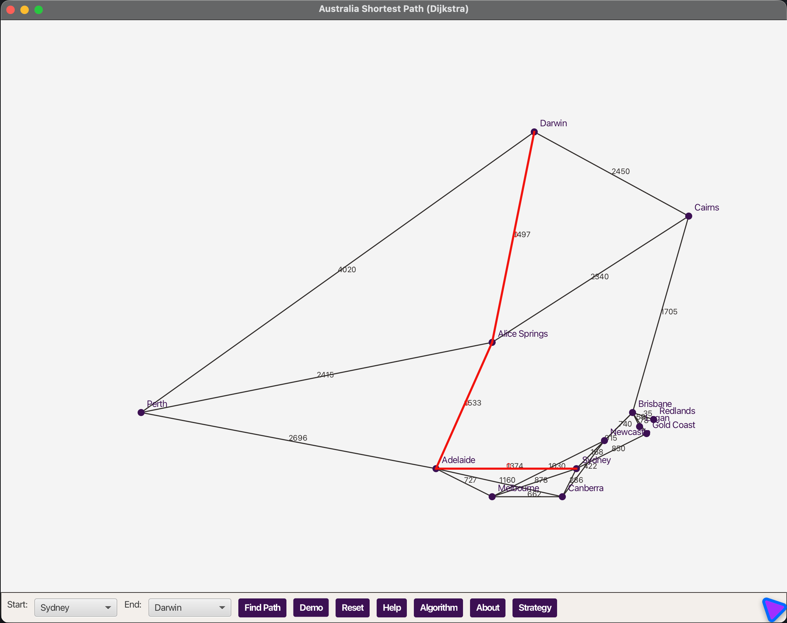

Australia Shortest Path (Graph Theory)

This JavaFX app visualises Australian cities as a weighted, undirected graph and computes the shortest route between two cities. The app uses Dijkstra's algorithm, optimal for non‑negative edge weights (road distances in kilometres).

Why Dijkstra?
- Non‑negative weights only (distances), single‑source query, fast with a min‑heap.

Other algorithms
- A*: Dijkstra with an admissible heuristic (e.g., great‑circle distance) to speed search.
- Bellman–Ford: supports negative edges, slower; unnecessary here.
- Floyd–Warshall: all‑pairs shortest paths for dense graphs or precomputation.

Run
- mvn test
- mvn clean compile
- mvn javafx:run

Use
- Pick Start and End, then click Find Path to highlight the optimal path in red.
- Demo shows Sydney → Darwin.
- Reset returns to the base network view.
- Help, Algorithm, and Strategy provide learning notes.

Data
- Graph: `src/main/resources/australia-graph.json` with nodes (name, x, y) and edges (from, to, distance).
- Coordinates are for drawing on the background map (not latitude/longitude).

