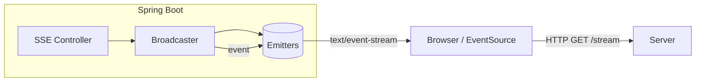
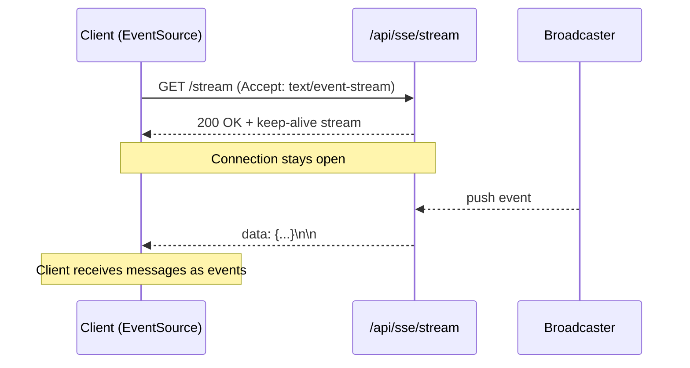

# Server-Sent Events (SSE) Concepts

SSE is a simple uni-directional streaming protocol over HTTP where the server pushes events to the client. The client uses `EventSource` (browser) or a streaming HTTP client.

## Why SSE?

- Lightweight one-way updates (no WebSocket handshake/state)
- Native browser support via `EventSource`
- Auto-reconnect with Last-Event-ID
- Great for notifications, dashboards, logs

## Architecture



## Sequence



## Client reconnection

- Browser `EventSource` auto-reconnects if the connection drops
- Server can send `id:` field; client resends `Last-Event-ID` header to resume
- Heartbeats (comments) prevent idle timeouts

Example client:

```html
<script>
  const es = new EventSource('/api/sse/stream');
  es.onmessage = (e) => console.log('message', e.data);
  es.addEventListener('connected', e => console.log(e.data));
</script>
```

## In this module

- Subscribe: `GET /api/sse/stream`
- Broadcast: `POST /api/sse/send?message=...`
- Health: `GET /api/sse/health`
