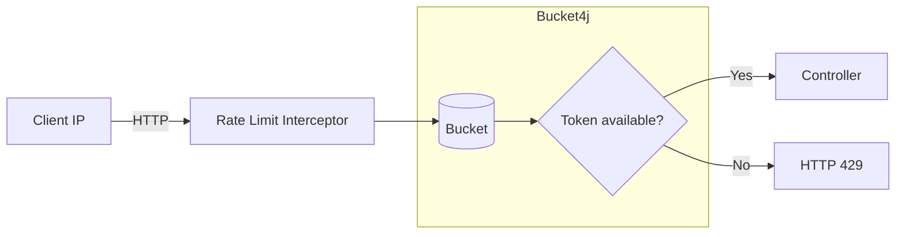
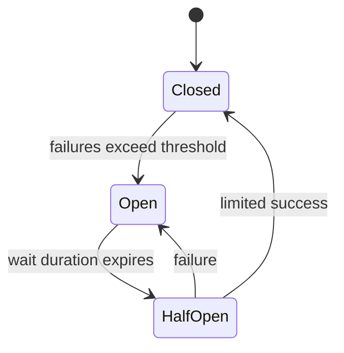
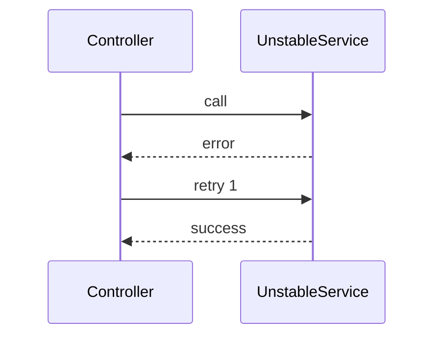
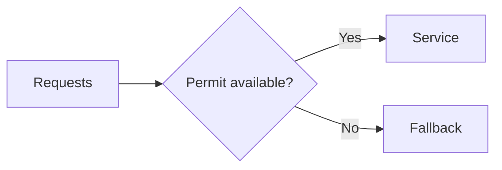

# Rate Limiting and Resilience Concepts

This module demonstrates API protection and resilience: Bucket4j rate limiting and Resilience4j Circuit Breaker, Retry, and Bulkhead.

## Bucket4j Rate Limiting

- Token bucket: capacity N, refilled at R tokens/time
- Each request consumes 1 token; if empty → 429 Too Many Requests

## Circuit Breaker

- Tracks failures; opens when threshold exceeded to prevent cascading failures
- States: Closed → Open → Half-Open → Closed

## Retry

- Automatically re-executes failing calls with backoff
- Combine with Circuit Breaker carefully to avoid overload

## Bulkhead

- Limits concurrent calls to protect overall system
- Semaphore/ThreadPool isolation

## In this module

- Rate limiting: `IpRateLimitInterceptor` + Bucket4j
- Resilience: `UnstableService` annotated with CB/Retry/Bulkhead
- Endpoints: `/api/rl/health`, `/api/rl/fast`, `/api/rl/unstable`
