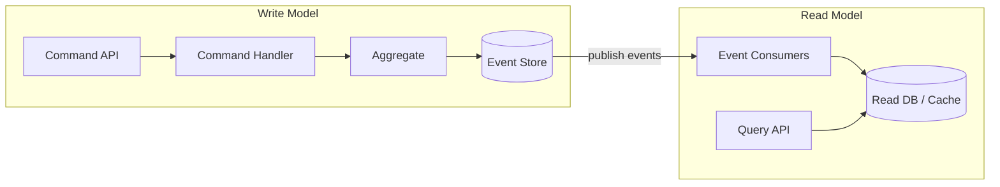

# CQRS (Command Query Responsibility Segregation)

CQRS separates the write (commands) and read (queries) paths. Writes change state; reads return data. This allows independent scaling, models, and optimizations.

## Why use it?
- Independent scaling for read vs write
- Optimized models for each side
- Enables event-driven read models with projections
- Reduces contention in high-throughput systems

## Core concepts
- Command: intent to change state (validated by domain)
- Query: request for data, no side effects
- Projection: read model updated from domain events

## High-level architecture

## In this module
- Commands: open, deposit, withdraw via `AccountCommandService`
- Queries: `currentBalance` via `AccountQueryService`
- Projection: implicit (rebuild by replay on query); could be persisted in a separate read store in a real system

## Notes
- CQRS does not require Event Sourcing, but they complement each other well
- Consistency: expect eventual consistency between write and read sides when using projections
