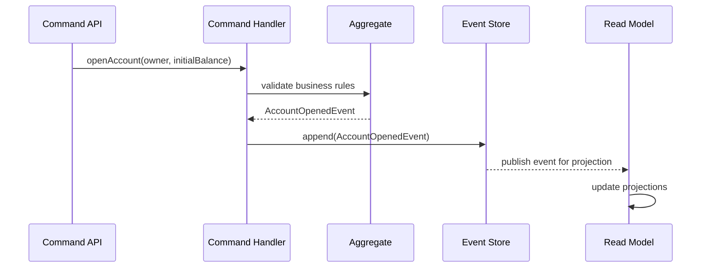
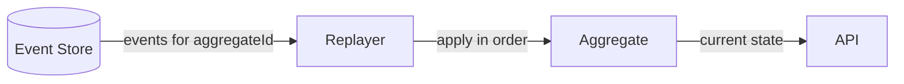

# Event Sourcing

Event Sourcing stores every state change as an immutable domain event. Current state is reconstructed by replaying events for an aggregate in order.

## Why use it?
- Auditability and traceability
- Time-travel and temporal queries
- Rebuild read models by replaying
- Natural fit for event-driven architectures

## Core concepts
- Aggregate: consistency boundary (e.g., BankAccount)
- Domain Event: an immutable fact that happened
- Event Store: append-only log of events per aggregate
- Replay: fold events to rebuild current state

## Command flow

## Rebuild by replay

## In this module
- Aggregate: `BankAccount`
- Events: `AccountOpened`, `MoneyDeposited`, `MoneyWithdrawn`
- Store: `InMemoryEventStore`
- Replay: applied on command handling and queries to rebuild state

Limitations (demo): in-memory store, no concurrency/version checks, simple projections.
