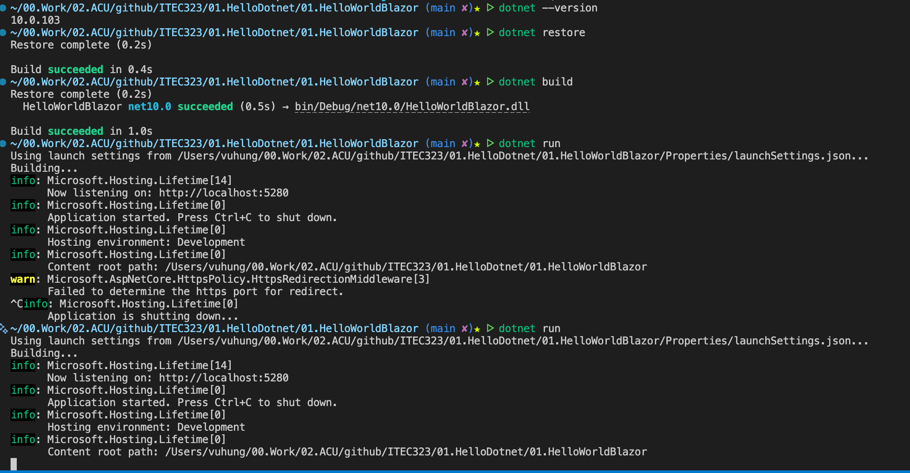

# Hello World Blazor

A simple Blazor Web App that demonstrates the basics of building modern web applications with .NET. This is your entry point into the world of interactive web development using C# instead of JavaScript.

# Screenshots

## The command line interface (CLI) to create and run the Blazor app
 

## The default Blazor template running in the browser


## Learning Objectives

By completing this project, you will learn:

- How to create a Blazor application using the .NET CLI
- The basic structure of a Blazor project
- How Blazor components work with the `@page` directive
- The relationship between routing and page components
- How to run and test a Blazor web application locally

## What is Blazor?

Blazor is a modern web framework from Microsoft that lets you build interactive web UIs using C# instead of JavaScript. It's part of the ASP.NET Core ecosystem and enables you to:

- Write client-side and server-side code in C#
- Share code between client and server
- Build interactive web UIs with reusable components
- Use the full power of .NET and its ecosystem

## Prerequisites

To work with this project, you'll need:

- **.NET 8.0 SDK or later** (this project targets .NET 10.0)
- A code editor such as **Visual Studio Code**, **Visual Studio**, or **Rider**
- A modern web browser (Chrome, Edge, Firefox, or Safari)
- Basic understanding of HTML and C# syntax

## Quick Links

- [QUICKSTART.md](QUICKSTART.md) - Step-by-step instructions to build and run this project
- [FRD.md](FRD.md) - Functional Requirements Document
- [docs/BlazorBasics.md](docs/BlazorBasics.md) - Detailed explanation of Blazor concepts

## Technology Stack

- **Framework**: Blazor Web App (ASP.NET Core)
- **Language**: C# with Razor syntax
- **Target Framework**: .NET 10.0 (compatible with .NET 8.0 and 9.0)
- **Runtime**: Kestrel web server
- **Template**: `blazor` (modern unified template)

## Project Structure

```
HelloWorldBlazor/
├── Components/              # Blazor components
│   ├── Layout/             # Layout components (navigation, main layout)
│   ├── Pages/              # Page components (routable views)
│   │   └── Home.razor      # Main "Hello World" page
│   ├── App.razor           # Root component
│   ├── Routes.razor        # Routing configuration
│   └── _Imports.razor      # Common using statements
├── Properties/              # Launch settings
├── wwwroot/                # Static files (CSS, JavaScript, images)
├── docs/                   # Documentation
├── Program.cs              # Application entry point
├── appsettings.json        # Application configuration
├── README.md               # This file
├── QUICKSTART.md           # Getting started guide
└── FRD.md                  # Functional requirements
```

## Key Files

### Home.razor
The main page component that displays "Hello, World!" Located at `Components/Pages/Home.razor`, this file demonstrates:
- The `@page` directive for routing
- The `<PageTitle>` component for setting the browser tab title
- Basic HTML markup within a Razor component

### Program.cs
The application entry point that:
- Configures the web application builder
- Registers Blazor services
- Sets up the HTTP request pipeline
- Configures routing for razor components

## What's Next?

After getting this basic "Hello World" application running:

1. **Add interactivity**: Add a button and counter to see how Blazor handles events
2. **Create components**: Build reusable UI components
3. **Learn routing**: Add more pages and navigate between them
4. **Style it**: Customize the CSS in `wwwroot/css/`
5. **Add data**: Connect to APIs or databases

## Educational Notes

This project is intentionally simple to help you understand the fundamentals:

- **No complex logic**: The focus is on understanding the Blazor structure, not business logic
- **Minimal styling**: Basic HTML without distracting CSS frameworks
- **Clear separation**: Components are organized logically in folders
- **Modern approach**: Uses the latest Blazor Web App template (not the older Server/WebAssembly split)

## Additional Resources

- [Official Blazor Documentation](https://learn.microsoft.com/en-us/aspnet/core/blazor/)
- [Blazor Tutorial](https://dotnet.microsoft.com/learn/aspnet/blazor-tutorial/intro)
- [C# Documentation](https://learn.microsoft.com/en-us/dotnet/csharp/)
- [ASP.NET Core Documentation](https://learn.microsoft.com/en-us/aspnet/core/)

## Support

For issues or questions:
1. Check the [QUICKSTART.md](QUICKSTART.md) troubleshooting section
2. Review the [docs/](docs/) folder for detailed explanations
3. Refer to the official Blazor documentation

---

**Course**: ITEC323 - Application Development  
**Institution**: Australian Catholic University (ACU)  
**Last Updated**: February 2026
