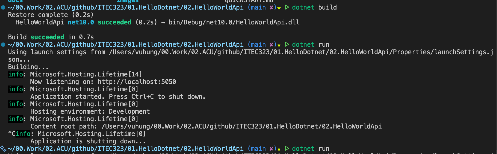
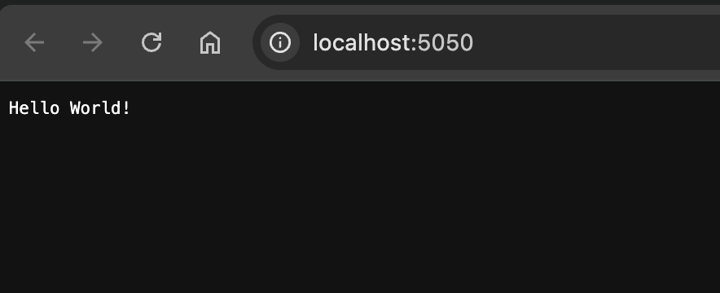

# Hello World API

A minimal API application that demonstrates the basics of building web APIs with ASP.NET Core. This is your entry point into the world of backend web development using .NET's modern minimal hosting model.

## Screenshots

## The command line interface (CLI) to create and run the API
 

## The API response in the browser


## The command line interface (CLI) to create and run the API
*Coming soon - screenshots will be added after first run*

## The API response in the browser
*Coming soon - screenshots will be added after first run*

## Learning Objectives

By completing this project, you will learn:

- How to create a minimal API using the .NET CLI
- The basic structure of an ASP.NET Core minimal API project
- How minimal APIs work with endpoint mapping
- The relationship between HTTP requests and API endpoints
- How to run and test a web API locally
- The difference between traditional controllers and minimal APIs

## What is a Minimal API?

Minimal APIs are a simplified way to build HTTP APIs with ASP.NET Core. Introduced in .NET 6, they reduce the ceremony and boilerplate code needed to create APIs, making them perfect for learning and small services.

### Why Minimal APIs?

- **Less Code**: No need for controllers or complex setup
- **Easy to Learn**: Straightforward syntax perfect for beginners
- **Fast Development**: Get an API running in just a few lines of code
- **Modern Approach**: Uses the latest .NET features and patterns
- **Scalable**: Can grow from simple to complex as needed

### Traditional vs Minimal APIs

**Traditional API** (Controller-based):
```csharp
[ApiController]
[Route("[controller]")]
public class HelloController : ControllerBase
{
    [HttpGet]
    public string Get() => "Hello World!";
}
```

**Minimal API**:
```csharp
app.MapGet("/", () => "Hello World!");
```

Both do the same thing, but minimal APIs are more concise!

## Prerequisites

To work with this project, you'll need:

- **.NET 8.0 SDK or later** (this project targets .NET 10.0)
- A code editor such as **Visual Studio Code**, **Visual Studio**, or **Rider**
- A modern web browser (Chrome, Edge, Firefox, or Safari)
- Basic understanding of HTTP and C# syntax

## Quick Links

- [QUICKSTART.md](QUICKSTART.md) - Step-by-step instructions to build and run this project
- [FRD.md](FRD.md) - Functional Requirements Document
- [docs/MinimalApiBasics.md](docs/MinimalApiBasics.md) - Detailed explanation of minimal API concepts

## Technology Stack

- **Framework**: ASP.NET Core Minimal API
- **Language**: C#
- **Target Framework**: .NET 10.0 (compatible with .NET 8.0 and 9.0)
- **Runtime**: Kestrel web server
- **Template**: `web` (minimal API template)

## Project Structure

```
HelloWorldApi/
├── Properties/              # Launch settings
│   └── launchSettings.json  # Port and environment configuration
├── docs/                    # Documentation
│   └── MinimalApiBasics.md  # Detailed API concepts
├── images/                  # Screenshots and diagrams
├── Program.cs               # Application entry point and API definition
├── appsettings.json         # Application configuration
├── appsettings.Development.json # Development configuration
├── HelloWorldApi.csproj     # Project file
├── README.md                # This file
├── QUICKSTART.md            # Getting started guide
└── FRD.md                   # Functional requirements
```

## Key Files

### Program.cs
The heart of the application. This single file:
- Creates and configures the web application
- Defines API endpoints using `MapGet`, `MapPost`, etc.
- Starts the web server

In this simple example, it contains just 6 meaningful lines of code!

### appsettings.json
Configuration file for the application:
- Logging levels
- Environment-specific settings
- Connection strings (for database projects)
- Custom application settings

### launchSettings.json
Defines how the application runs:
- HTTP and HTTPS ports
- Environment variables
- Launch behavior (open browser, etc.)

## Understanding the Code

### The Minimal Hosting Model

```csharp
var builder = WebApplication.CreateBuilder(args);
var app = builder.Build();

app.MapGet("/", () => "Hello World!");

app.Run();
```

Let's break this down:

1. **`WebApplication.CreateBuilder(args)`**
   - Creates a builder with pre-configured defaults
   - Sets up logging, configuration, and dependency injection
   - Prepares the application for customization

2. **`builder.Build()`**
   - Builds the web application with all configured services
   - Creates the web server (Kestrel)
   - Prepares the HTTP pipeline

3. **`app.MapGet("/", () => "Hello World!")`**
   - Maps an HTTP GET request to the root path `/`
   - When accessed, returns the string "Hello World!"
   - Uses a lambda expression for the handler

4. **`app.Run()`**
   - Starts the web server
   - Begins listening for HTTP requests
   - Blocks until the application is shut down

## Testing Your API

Once running, you can test your API several ways:

### 1. Web Browser
Navigate to `http://localhost:5050` to see "Hello World!"

### 2. Command Line (curl)
```bash
curl http://localhost:5050
# Output: Hello World!
```

### 3. PowerShell
```powershell
Invoke-WebRequest http://localhost:5050
```

### 4. API Testing Tools
- **Postman**: Popular API testing application
- **REST Client**: VS Code extension
- **Swagger/OpenAPI**: Can be added for interactive API documentation

## What's Next?

After getting this basic API running:

1. **Add more endpoints**: Create `/hello/{name}` to greet users personally
2. **Return JSON**: Use objects instead of strings for structured data
3. **Add POST endpoints**: Accept data from clients
4. **Learn routing**: Understand route patterns and parameters
5. **Add middleware**: Logging, authentication, error handling
6. **Connect to a database**: Store and retrieve data
7. **Add Swagger**: Interactive API documentation

## Common Issues and Solutions

### Port Already in Use
If you see an error about the port being in use:
```bash
# Change the port in Properties/launchSettings.json
# Or specify a different port when running:
dotnet run --urls "http://localhost:5051"
```

### HTTPS Certificate Warning
On first run, you might need to trust the development certificate:
```bash
dotnet dev-certs https --trust
```

### Application Not Accessible
- Check if the application is running (look for startup messages)
- Verify the URL matches what's shown in the terminal
- Try both HTTP and HTTPS URLs
- Check firewall settings

## Learning Resources

- [ASP.NET Core Documentation](https://docs.microsoft.com/aspnet/core)
- [Minimal APIs Overview](https://docs.microsoft.com/aspnet/core/fundamentals/minimal-apis)
- [HTTP Methods Explained](https://developer.mozilla.org/en-US/docs/Web/HTTP/Methods)
- [RESTful API Design](https://restfulapi.net/)

## Project Philosophy

This project follows the ITEC323 educational principles:
- **Simple First**: Master basics before adding complexity
- **Well Documented**: Every concept is explained
- **Hands-On**: Learn by doing and experimenting
- **Foundation Building**: Prepares you for advanced topics

---

**Course**: ITEC323 - Application Development  
**Institution**: Australian Catholic University (ACU)  
**Last Updated**: February 2026
