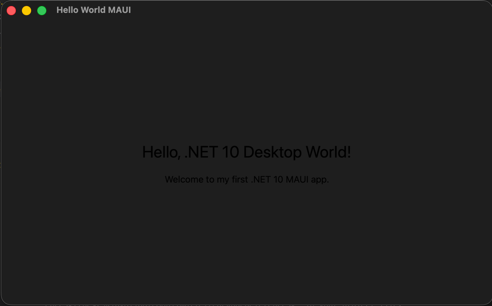

# Hello World MAUI Desktop App

A simple .NET MAUI desktop application that demonstrates the basics of cross-platform desktop development using C# and XAML. This is your entry point into building native desktop apps for both macOS and Windows from one shared codebase.

## Screenshots

### The desktop app on Mac Catalyst (macOS)



## The command line interface (CLI) to create and run the MAUI app
*Coming soon - screenshots will be added after first run*

## The MAUI desktop window
*Coming soon - screenshots will be added after first run*

## Learning Objectives

By completing this project, you will learn:

- How to set up MAUI tooling with the .NET CLI
- The basic structure of a .NET MAUI desktop project
- How XAML defines UI layout for MAUI pages
- How a shared UI can run on macOS and Windows
- How to build and run a MAUI desktop application locally

## What is .NET MAUI?

.NET MAUI (Multi-platform App UI) is Microsoft's framework for building native applications across multiple platforms using one shared .NET codebase. In this project, we focus on desktop targets:

- **Mac Catalyst** for macOS
- **WinUI** for Windows

## Prerequisites

To work with this project, you'll need:

- **.NET 10.0 SDK or later** (this project targets .NET 10 desktop frameworks)
- **MAUI workload installed** via `dotnet workload install maui`
- A code editor such as **Visual Studio Code**, **Visual Studio**, or **Rider**
- **macOS** (for Mac Catalyst) or **Windows 10/11** (for WinUI)

## Quick Links

- [QUICKSTART.md](QUICKSTART.md) - Step-by-step instructions to build and run this project
- [FRD.md](FRD.md) - Functional Requirements Document
- [docs/MauiDesktopBasics.md](docs/MauiDesktopBasics.md) - Detailed explanation of MAUI desktop concepts

## Technology Stack

- **Framework**: .NET MAUI
- **Language**: C# and XAML
- **Target Frameworks**:
  - `net10.0-maccatalyst`
  - `net10.0-windows10.0.19041.0`
- **Desktop Platforms**: macOS and Windows
- **Template Base**: `maui`

## Project Structure

```
03.DesktopApp-MAUI/
├── Platforms/                  # Platform-specific startup files
│   ├── MacCatalyst/            # macOS startup files
│   └── Windows/                # Windows startup files
├── docs/                       # Documentation
│   └── MauiDesktopBasics.md    # MAUI desktop concepts
├── images/                     # Screenshots and diagrams
├── App.xaml                    # Application-level resources
├── App.xaml.cs                 # Application startup class
├── MainPage.xaml               # Main desktop UI page
├── MainPage.xaml.cs            # Main page code-behind
├── MauiProgram.cs              # MAUI app configuration
├── HelloWorldMaui.csproj       # Project file
├── README.md                   # This file
├── QUICKSTART.md               # Getting started guide
└── FRD.md                      # Functional requirements
```

## Key Files

### MainPage.xaml
Defines the UI shown when the app starts. It displays:
- "Hello, .NET 10 Desktop World!"
- "Welcome to my first .NET 10 MAUI app."

### MauiProgram.cs
Configures and creates the MAUI app through `MauiApp.CreateBuilder()`.

### Platforms/
Contains desktop-specific startup files for:
- `MacCatalyst` (macOS)
- `Windows` (WinUI)

## What's Next?

After getting this desktop app running:

1. Add a button click event in `MainPage.xaml.cs`
2. Add an input field and display user-entered text
3. Create a second page and navigate to it
4. Add basic styling with app-level resources in `App.xaml`
5. Introduce MVVM in a later exercise

## Educational Notes

This project is intentionally simple to support first-time learners:

- **Minimal UI**: Focus on understanding structure before adding complexity
- **Clear file roles**: Shared code and platform startup files are easy to identify
- **Beginner-friendly code**: No advanced patterns required to run the app

## Additional Resources

- [Official .NET MAUI Documentation](https://learn.microsoft.com/dotnet/maui/)
- [MAUI XAML Fundamentals](https://learn.microsoft.com/en-us/dotnet/maui/xaml/fundamentals/get-started?view=net-maui-10.0)
- [C# Documentation](https://learn.microsoft.com/dotnet/csharp/)

