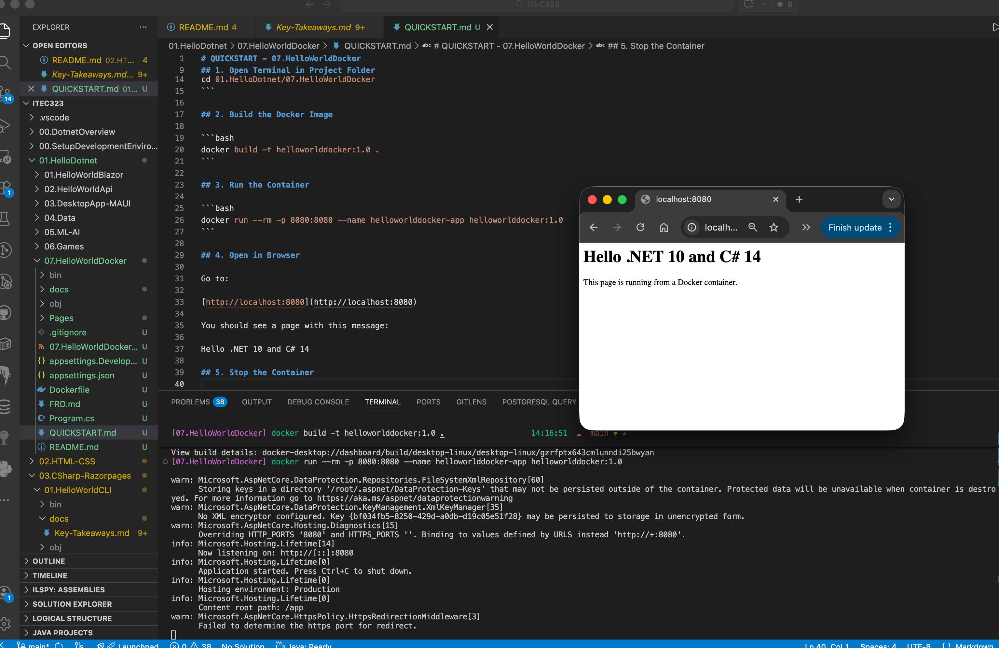

# 07.HelloWorldDocker

## Overview

This project demonstrates how to build and run a minimal ASP.NET Core Razor Pages app in Docker.

It is designed for beginners who are learning:

- .NET 10
- C# 14
- Basic Docker workflow for .NET apps

# Screenshot 

## Learning Objectives

By completing this demo, you will be able to:

1. Create and understand a minimal Razor Pages app.
2. Build a Docker image using a multi-stage Dockerfile.
3. Run the app in a container and access it from a browser.
4. Understand why separate build and runtime images are used.

## Technology Stack

- .NET SDK 10.0
- ASP.NET Core Razor Pages
- C# 14
- Docker
- Base images from Microsoft Container Registry (MCR):
  - mcr.microsoft.com/dotnet/sdk:10.0
  - mcr.microsoft.com/dotnet/aspnet:10.0

## Project Files

- 07.HelloWorldDocker.csproj: Project configuration targeting .NET 10 and C# 14.
- Program.cs: App startup and route mapping.
- Pages/Index.cshtml: The Hello page shown in the browser.
- Pages/Index.cshtml.cs: Page model for the Index page.
- Dockerfile: Multi-stage Docker build and runtime configuration.
- QUICKSTART.md: Step-by-step run instructions.
- FRD.md: Functional requirements for this demo.
- docs/Key-Takeaways.md: Summary of key learning points.

## Quick Links

- Setup and run instructions: QUICKSTART.md
- Functional requirements: FRD.md
- Learning summary: docs/Key-Takeaways.md
