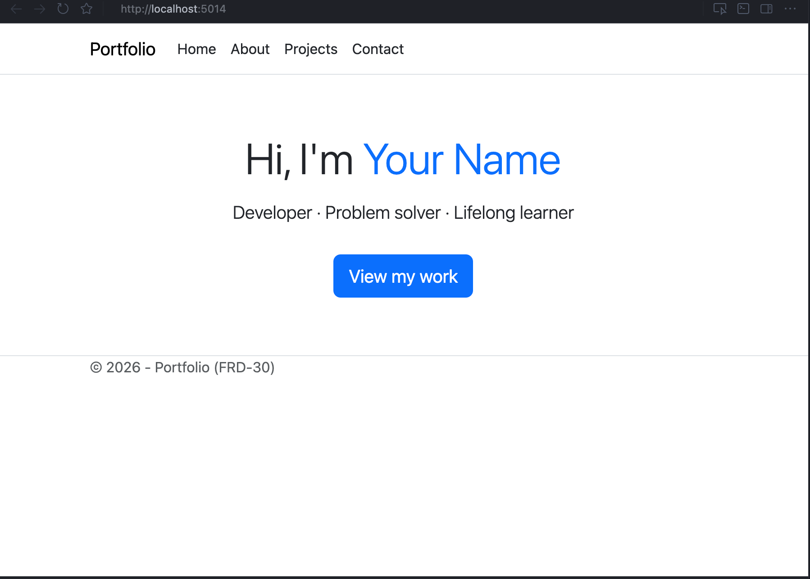

# FRD-30 Portfolio Website

ASP.NET Core Razor Pages portfolio site for ITEC323 (FRD-30). It showcases a simple multi-page website built with C#, HTML, CSS, and JavaScript.

# Screenshots



## Contents

- **Home** – Intro and call-to-action to projects
- **About** – Short bio and skills
- **Projects** – Grid of project cards
- **Contact** – Email and social links

The site is responsive (Bootstrap) and uses the standard ASP.NET Core Razor Pages stack.

## Tech stack

- **C#** / **ASP.NET Core** (Razor Pages)
- **HTML** (Razor `.cshtml`)
- **CSS** (Bootstrap + `wwwroot/css/site.css`)
- **JavaScript** (Bootstrap + `wwwroot/js/site.js`)
- **Target**: .NET 10.0

## Quick start

See [QUICKSTART.md](QUICKSTART.md) for build and run steps.

## Project layout

```
FRD-30-portfolio-website/
├── Pages/           # Razor Pages (Index, About, Projects, Contact)
├── wwwroot/
│   ├── css/         # site.css
│   └── js/          # site.js
├── Program.cs
└── README.md
```

## Customisation

- **Home**: Edit `Pages/Index.cshtml` (name, tagline, button).
- **About**: Edit `Pages/About.cshtml` (bio, skills list).
- **Projects**: Edit `Pages/Projects.cshtml` (titles, descriptions, links).
- **Contact**: Edit `Pages/Contact.cshtml` (email, LinkedIn, GitHub URLs).

## Documentation

- [QUICKSTART.md](QUICKSTART.md) – How to run the project
