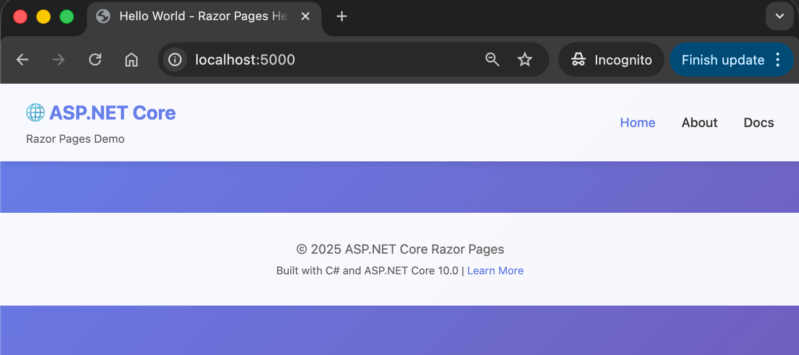

# Hello World - ASP.NET Core Razor Pages

## Overview

A simple "Hello World" web application using **ASP.NET Core Razor Pages**. This is your first step into web development with C# and .NET.

## Screenshot



## 🎯 Learning Objectives

By completing this project, you will learn:

1. **Web Applications vs Console Applications**
   - How web apps run continuously on a server
   - How browsers communicate with web servers using HTTP

2. **ASP.NET Core Basics**
   - Setting up a simple web application
   - Running a web server (Kestrel)

3. **Razor Pages**
   - Combining HTML with C# code
   - Separating logic (code-behind) from presentation (views)

## 📋 Prerequisites

- **.NET 10.0 SDK** or later ([Download here](https://dotnet.microsoft.com/download))
- **Text editor** (Visual Studio Code recommended)
- **Web browser** (Chrome, Firefox, Edge, or Safari)

Check your .NET version:
```bash
dotnet --version
```

Expected output: `10.0.103` or higher

## 🏗️ Project Structure

```
04.RazorPages-HelloWorld/
├── Program.cs                  # Application entry point
├── RazorPagesHelloWorld.csproj # Project file
├── Pages/
│   ├── Index.cshtml            # View (HTML + Razor)
│   └── Index.cshtml.cs         # Page model (C# code-behind)
├── wwwroot/                    # Static files (CSS, etc.)
└── docs/                       # Documentation
```

## � Quick Start

See [QUICKSTART.md](QUICKSTART.md) for detailed instructions.

**Quick version:**
```bash
# Navigate to the project directory
cd 03.CSharp/04.RazorPages-HelloWorld

# Build and run
dotnet build
dotnet run

# Open your browser to:
https://localhost:5001
```

Press **Ctrl+C** to stop the server.

## 📚 How It Works

```
1. Browser requests: https://localhost:5001
2. ASP.NET Core receives the request
3. Routing finds Index.cshtml
4. OnGet() method in Index.cshtml.cs runs (sets Message property)
5. Razor engine combines C# data with HTML
6. Server sends HTML to browser
7. Browser displays the page
```

## 🔑 Key Files

- **Program.cs** - Entry point, configures the web server
- **Index.cshtml** - HTML view with Razor syntax
- **Index.cshtml.cs** - C# code-behind with page logic

## 🧪 Try This

1. Change the message in `Index.cshtml.cs`
2. Modify the date/time format
3. Add a new property and display it

## 📖 Learn More

- [QUICKSTART.md](QUICKSTART.md) - Detailed build and run guide
- [docs/Key-Takeaways.md](docs/Key-Takeaways.md) - In-depth explanations

---

**Part of ITEC323 - C# Programming Course**

