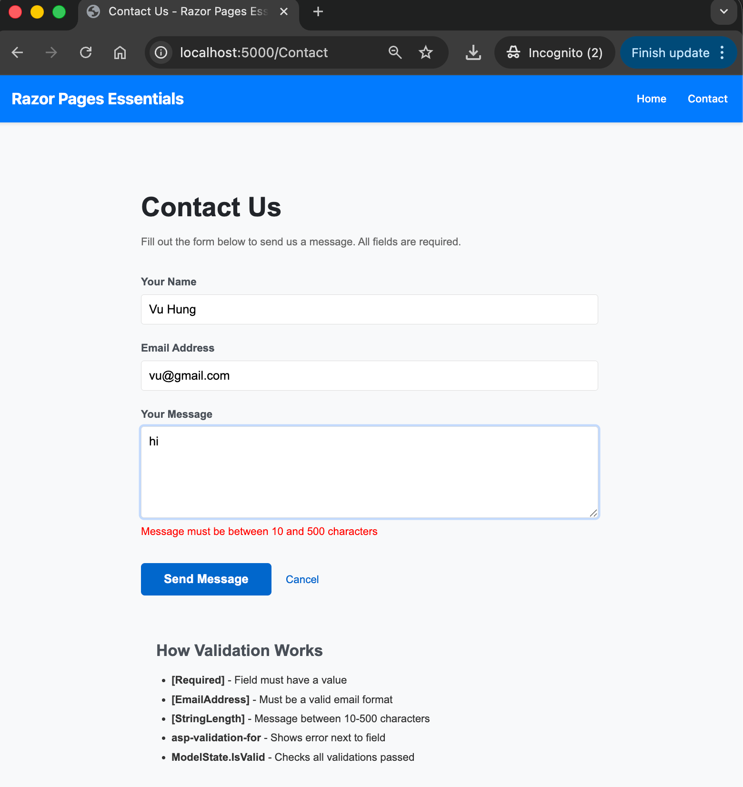
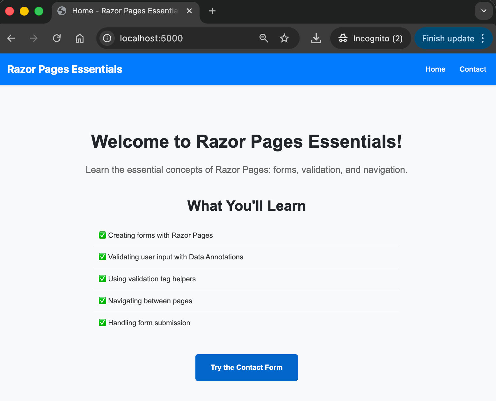

# Razor Pages Essentials

A beginner-friendly ASP.NET Core Razor Pages project demonstrating essential web development concepts including form handling, validation, and navigation.

# Screenshots

 

## 🎯 Learning Objectives

By completing this project, you will learn:

1. **Form Handling** - How to create HTML forms and process user input
2. **Data Validation** - Using Data Annotations to validate user input both client-side and server-side
3. **Navigation** - Moving between pages using the Post-Redirect-Get pattern
4. **Tag Helpers** - Using ASP.NET Core Tag Helpers to simplify Razor syntax
5. **TempData** - Passing data between pages during redirects
6. **Page Models** - Separating logic from presentation using the code-behind pattern

## 📋 Prerequisites

- .NET 8.0 SDK or later
- A code editor (VS Code, Visual Studio, or Rider)
- Basic understanding of C# and HTML
- Completion of [04.RazorPages-HelloWorld](../04.RazorPages-HelloWorld/) project

## 🚀 Quick Start

```bash
# Navigate to the project directory
cd 03.CSharp/05.RazorPages-Essentials

# Restore dependencies
dotnet restore

# Build the project
dotnet build

# Run the application
dotnet run
```

Then open your browser to: `https://localhost:5001` (or the URL shown in the terminal)

For detailed setup instructions, see [QUICKSTART.md](QUICKSTART.md)

## 📁 Project Structure

```
05.RazorPages-Essentials/
├── Pages/                          # Razor Pages
│   ├── Index.cshtml               # Home page
│   ├── Index.cshtml.cs            # Home page model
│   ├── Contact.cshtml             # Contact form page
│   ├── Contact.cshtml.cs          # Contact form logic
│   ├── Success.cshtml             # Success confirmation page
│   ├── Success.cshtml.cs          # Success page model
│   ├── Privacy.cshtml             # Privacy policy page
│   ├── Privacy.cshtml.cs          # Privacy page model
│   ├── Error.cshtml               # Error page
│   ├── Error.cshtml.cs            # Error page model
│   ├── _ViewImports.cshtml        # Global using directives
│   ├── _ViewStart.cshtml          # Default layout setting
│   └── Shared/                    # Shared components
│       ├── _Layout.cshtml         # Main layout template
│       └── _ValidationScriptsPartial.cshtml  # Validation scripts
├── wwwroot/                       # Static files
│   ├── css/
│   │   └── site.css              # Main stylesheet
│   └── js/
│       └── site.js               # Site JavaScript
├── Program.cs                     # Application entry point
├── RazorPagesEssentials.csproj   # Project file
├── README.md                      # This file
├── QUICKSTART.md                  # Detailed setup guide
└── docs/
    └── Key-Takeaways.md          # Detailed learning notes
```

## 🔑 Key Features Demonstrated

### 1. Data Annotations Validation

The Contact page demonstrates validation using Data Annotations:

- `[Required]` - Ensures a field is not empty
- `[EmailAddress]` - Validates email format
- `[StringLength]` - Enforces minimum and maximum length

```csharp
[Required(ErrorMessage = "Please enter your name")]
public string Name { get; set; } = string.Empty;

[Required(ErrorMessage = "Please enter your email address")]
[EmailAddress(ErrorMessage = "Please enter a valid email address")]
public string Email { get; set; } = string.Empty;
```

### 2. Tag Helpers

Tag Helpers provide an HTML-friendly way to work with server-side code:

```html
<!-- asp-for creates properly-named form fields -->
<input asp-for="Email" type="email" />

<!-- asp-validation-for displays validation errors -->
<span asp-validation-for="Email"></span>

<!-- asp-page creates links to other pages -->
<a asp-page="/Contact">Contact Us</a>
```

### 3. Post-Redirect-Get Pattern

After form submission, the application:
1. **POST**: Validates and processes the form data
2. **Redirect**: Sends the browser to a new page
3. **GET**: Displays the success page

This prevents duplicate form submissions on browser refresh.

### 4. TempData

TempData stores data for exactly one request, perfect for passing messages during redirects:

```csharp
TempData["SuccessMessage"] = "Thank you! Your message has been received.";
return RedirectToPage("/Success");
```

## 🎓 What's Next?

After completing this project, explore:

- **Database Integration** - Store form submissions in a database
- **Authentication** - Add user login and registration
- **File Uploads** - Handle file uploads in forms
- **AJAX Forms** - Submit forms without page refresh
- **Advanced Validation** - Custom validation attributes

## 📚 Additional Resources

- [Official ASP.NET Core Razor Pages Documentation](https://docs.microsoft.com/aspnet/core/razor-pages/)
- [Data Annotations Reference](https://docs.microsoft.com/dotnet/api/system.componentmodel.dataannotations)
- [Tag Helper Reference](https://docs.microsoft.com/aspnet/core/mvc/views/tag-helpers/intro)

## 📝 Learning Notes

For detailed explanations of concepts used in this project, see [docs/Key-Takeaways.md](docs/Key-Takeaways.md)

## 💡 Tips for Learning

1. **Read the Code Comments** - Every file has detailed comments explaining what's happening
2. **Experiment** - Try changing validation rules and see what happens
3. **Use Browser DevTools** - Inspect the HTML generated by Tag Helpers
4. **Test Validation** - Try submitting invalid data to see validation in action
5. **Follow the Flow** - Trace how data moves from form → validation → redirect → success page


