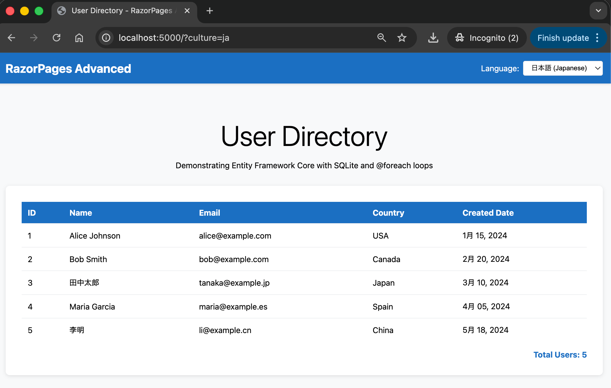

# RazorPages Advanced

An advanced ASP.NET Core Razor Pages application demonstrating Entity Framework Core, database operations with SQLite, data display with `@foreach` loops, and internationalization with localization support.

# Screenshot(s)



## Learning Objectives

By exploring this project, you will learn:

- **Entity Framework Core**: Using an ORM (Object-Relational Mapping) to interact with databases
- **SQLite Database**: Working with a lightweight, embedded database
- **@foreach Loops**: Displaying collections of data in Razor Pages
- **Localization**: Supporting multiple languages (English and Japanese)
- **JSON Serialization**: Understanding modern web data formats
- **Async/Await**: Using asynchronous programming for database operations

## Technology Stack

- **.NET 10.0**: Latest .NET framework
- **ASP.NET Core Razor Pages**: Server-side web framework
- **Entity Framework Core 10.0**: Database ORM
- **SQLite**: Embedded database engine
- **C# 14**: Latest C# language features

## Project Structure

```
06.RazorPages-Advanced/
├── Models/              # Data models (User)
├── Data/                # Database context and configuration
├── Pages/               # Razor Pages (Index, Privacy)
├── wwwroot/css/         # Stylesheets
├── appsettings.json     # Configuration
└── Program.cs           # Application startup
```

## Features

### 1. Entity Framework Core with SQLite
- Database-first approach with seed data
- 5 pre-populated users from different countries
- Automatic database creation on startup

### 2. Data Display with @foreach
- Displays users in an HTML table
- Shows ID, Name, Email, Country, and Created Date
- Demonstrates iteration over collections in Razor syntax

### 3. JSON Representation
- Shows data in JSON format
- Teaches modern data interchange formats
- Uses `JsonSerializer` for formatting

### 4. Localization (Future Enhancement)
- Infrastructure ready for English/Japanese support
- Language switcher in navigation bar
- Query string-based culture switching (`?culture=ja`)

## Quick Links

- [QUICKSTART.md](QUICKSTART.md) - Step-by-step setup instructions
- [docs/Key-Takeaways.md](docs/Key-Takeaways.md) - Core concepts explained
- [FRD.md](FRD.md) - Functional requirements document

## Prerequisites

- .NET 8.0 SDK or later (compatible with .NET 9, .NET 10)
- Code editor (VS Code, Visual Studio, or Rider)
- Basic understanding of C# and web development

## Getting Started

See [QUICKSTART.md](QUICKSTART.md) for detailed setup and running instructions.

Quick commands:
```bash
dotnet restore
dotnet build
dotnet run
```

Then open your browser to `https://localhost:5001` (or the URL shown in the terminal).

## Educational Notes

This project builds on concepts from `05.RazorPages-Essentials` and introduces:
- Database operations and ORM concepts
- Asynchronous programming patterns
- Data seeding and migrations
- International character support (日本語, 中文)

The code includes extensive comments explaining each concept for beginners.
