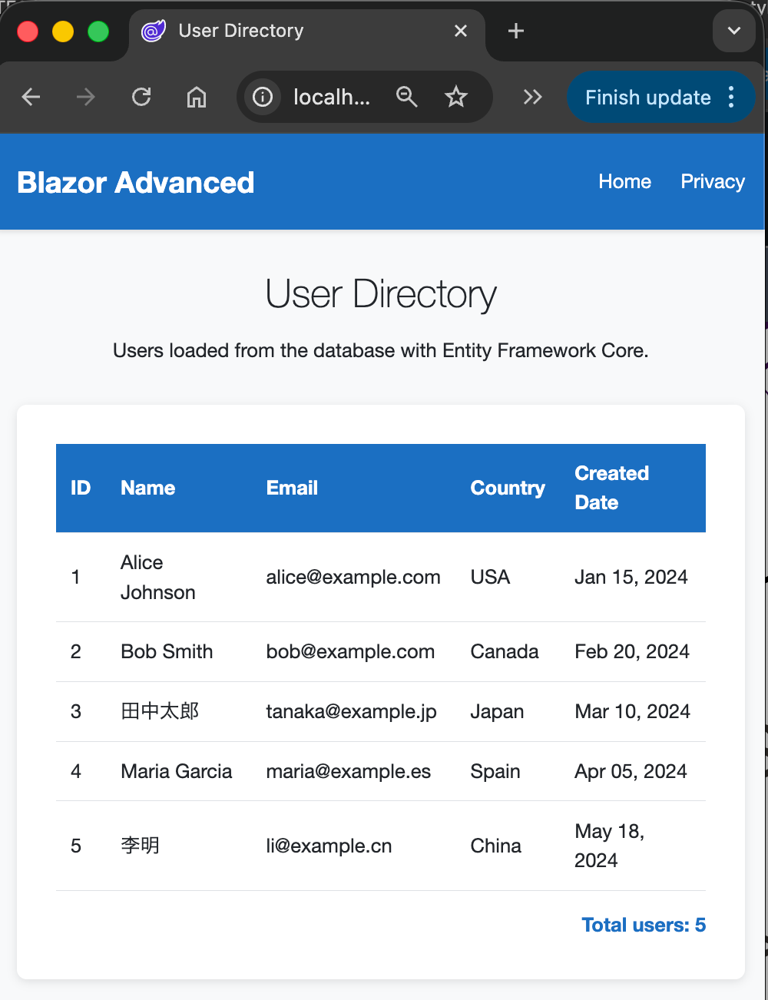
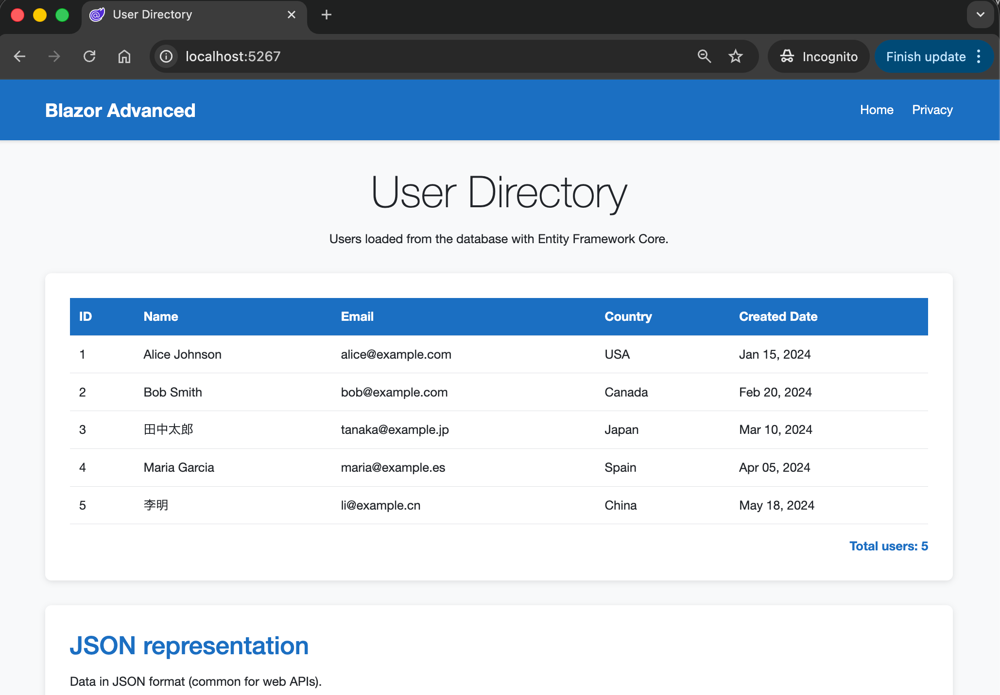

# Blazor Advanced

ASP.NET Core **Blazor Web App** (Server interactivity) that mirrors **06.RazorPages-Advanced**: EF Core, SQLite, user table, JSON output. Same concepts, Blazor instead of Razor Pages.

# Screenshot(s)




## Learning focus

- **Blazor components**: Routable pages (`@page`), `@code`, `OnInitializedAsync`
- **Entity Framework Core + SQLite**: Same `DbContext` and seed data as 06
- **Interactive Server**: `@rendermode InteractiveServer` for server-side UI updates
- **Data binding**: `@foreach`, display logic, JSON serialization in C#

## Tech stack

- .NET 10.0, C# 14
- Blazor Web App (Server)
- Entity Framework Core 10, SQLite

## Structure (mirrors 06)

```
07.BlazorPages-Advanced/
├── Components/Pages/    # Home, Privacy (Counter, Weather from template)
├── Components/Layout/   # MainLayout, NavMenu
├── Models/              # User
├── Data/                # AppDbContext
├── wwwroot/css/         # site.css
└── Program.cs
```

## Quick start

```bash
cd 03.CSharp-Razorpages/07.BlazorPages-Advanced
dotnet restore
dotnet build
dotnet run
```

Open `https://localhost:5001` (or the URL in the terminal). See [QUICKSTART.md](QUICKSTART.md) and [docs/Key-Takeaways.md](docs/Key-Takeaways.md).
