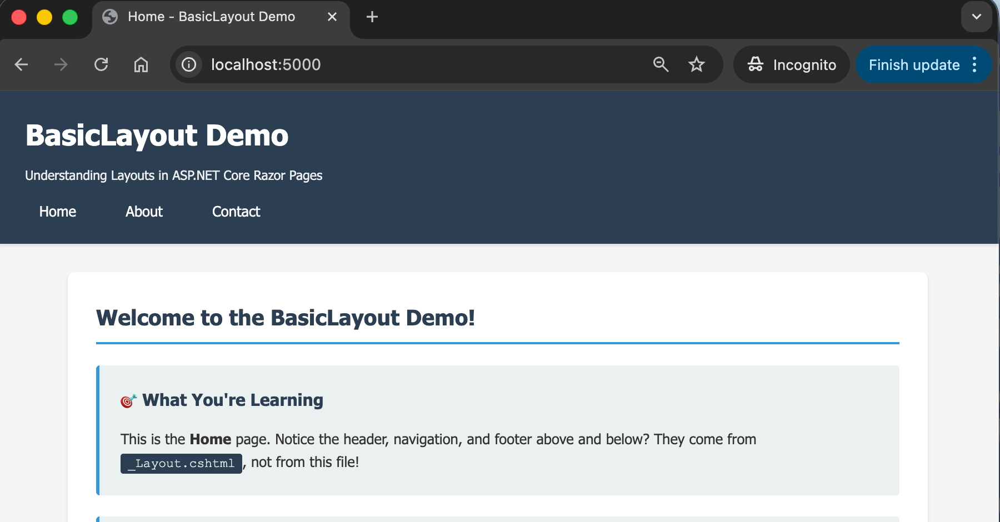

# 01.BasicLayout - Understanding the Layout System

## Overview

This project demonstrates the **fundamentals of ASP.NET Core Razor Pages layout system** with zero CSS framework distractions. Learn how `_Layout.cshtml`, `_ViewStart.cshtml`, and `_ViewImports.cshtml` work together to eliminate code duplication and create consistent websites.

## Screenshot



## Learning Objectives

By completing this project, you will:

1. ✅ Understand how `_Layout.cshtml` provides a master template for all pages
2. ✅ Use `_ViewStart.cshtml` to specify the default layout
3. ✅ Configure `_ViewImports.cshtml` for tag helpers and namespaces
4. ✅ Implement `@RenderBody()` to inject page content into layouts
5. ✅ Use `@RenderSection()` for optional page-specific content
6. ✅ Apply the DRY (Don't Repeat Yourself) principle to web development

## What You'll See

**Three pages** (Home, About, Contact) that share:
- Common header with site title
- Consistent navigation menu
- Same footer
- Unified styling

**But each page only contains its unique content** - no duplication!

## Key Concepts

### 1. _Layout.cshtml (The Master Template)

Located in `Pages/Shared/_Layout.cshtml`, this file contains the HTML structure shared by all pages:

```html
<!DOCTYPE html>
<html>
<head>
    <title>@ViewBag.Title - BasicLayout Demo</title>
</head>
<body>
    <header><!-- Appears on all pages --></header>
    <nav><!-- Appears on all pages --></nav>
    <main>
        @RenderBody() <!-- Page content goes here -->
    </main>
    <footer><!-- Appears on all pages --></footer>
</body>
</html>
```

**Key method**: `@RenderBody()` - This is where individual page content gets injected.

### 2. _ViewStart.cshtml (Layout Selector)

Located in `Pages/_ViewStart.cshtml`, runs before every page:

```csharp
@{
    Layout = "_Layout";
}
```

**Purpose**: Tells all pages "use `_Layout.cshtml` as your layout." Without this, you'd have to specify the layout on every single page.

### 3. _ViewImports.cshtml (Shared Imports)

Located in `Pages/_ViewImports.cshtml`, imports used by all pages:

```csharp
@using BasicLayout
@namespace BasicLayout.Pages
@addTagHelper *, Microsoft.AspNetCore.Mvc.TagHelpers
```

**Purpose**: Makes tag helpers (like `<partial>`) and namespaces available to all pages.

### 4. @RenderSection() (Optional Content)

Allows pages to inject specific content into the layout:

**In _Layout.cshtml**:
```csharp
@RenderSection("Scripts", required: false)
```

**In Contact.cshtml**:
```csharp
@section Scripts {
    <script>
        console.log("Only runs on Contact page!");
    </script>
}
```

## Project Structure

```
01.BasicLayout/
├── BasicLayout.csproj          # Project file (.NET 10.0)
├── Program.cs                  # Application entry point
├── appsettings.json           # Configuration
├── Pages/
│   ├── _ViewStart.cshtml      # Sets default layout for all pages
│   ├── _ViewImports.cshtml    # Imports tag helpers & namespaces
│   ├── Index.cshtml           # Home page
│   ├── Index.cshtml.cs        # Home page logic
│   ├── About.cshtml           # About page
│   ├── About.cshtml.cs        # About page logic
│   ├── Contact.cshtml         # Contact page (demonstrates @section)
│   ├── Contact.cshtml.cs      # Contact page logic
│   ├── Error.cshtml           # Error page
│   ├── Error.cshtml.cs        # Error page logic
│   └── Shared/
│       └── _Layout.cshtml     # Master template for all pages
├── wwwroot/
│   └── css/
│       └── site.css           # Minimal styling (no framework)
├── README.md                  # This file
├── QUICKSTART.md              # Setup and run instructions
└── docs/
    └── Key-Takeaways.md       # Important concepts summary
```

## The DRY Principle in Action

### ❌ Without Layouts (WET: Write Everything Twice)

Every page has duplicated code:

```html
<!-- Index.cshtml -->
<html>
<head>...</head>
<body>
    <header>...</header>
    <nav>...</nav>
    <main>Home content</main>
    <footer>...</footer>
</body>
</html>

<!-- About.cshtml -->
<html>
<head>...</head>
<body>
    <header>...</header>  <!-- Duplicated! -->
    <nav>...</nav>        <!-- Duplicated! -->
    <main>About content</main>
    <footer>...</footer>  <!-- Duplicated! -->
</body>
</html>

<!-- Same duplication in Contact.cshtml... -->
```

**Problem**: Need to update navigation? Change it in 3+ places!

### ✅ With Layouts (DRY: Don't Repeat Yourself)

**_Layout.cshtml** (write once):
```html
<html>
<head>...</head>
<body>
    <header>...</header>
    <nav>...</nav>
    <main>@RenderBody()</main>
    <footer>...</footer>
</body>
</html>
```

**Index.cshtml** (only unique content):
```html
@page
<h1>Home content</h1>
```

**About.cshtml** (only unique content):
```html
@page
<h1>About content</h1>
```

**Result**: Update navigation once, changes everywhere!

## How It Works: Request Flow

1. User requests `/About`
2. ASP.NET finds `About.cshtml`
3. `_ViewStart.cshtml` runs: "Use `_Layout` for this page"
4. `_ViewImports.cshtml` makes tag helpers available
5. Layout renders with `About.cshtml` content injected at `@RenderBody()`
6. Complete HTML sent to browser

## Why This Matters

| Aspect | Without Layouts | With Layouts |
|--------|----------------|--------------|
| **Code Duplication** | 100+ lines per page | 0 lines duplicated |
| **Update Navigation** | Edit 50 files | Edit 1 file |
| **Add New Page** | Copy/paste structure | Write content only |
| **Consistency** | Easy to make mistakes | Guaranteed consistency |
| **Maintenance Time** | Hours | Minutes |

## What Makes This Project Special

1. **No CSS frameworks**: Pure HTML and minimal CSS to focus on layouts, not styling
2. **Heavy documentation**: Every file has comments explaining what it does
3. **Progressive learning**: Start with Index (basic), then About (tables), then Contact (sections)
4. **Real-world patterns**: Structured like professional applications

## Prerequisites

- .NET 10.0 SDK installed
- Basic understanding of HTML
- Text editor or IDE (VS Code, Visual Studio, Rider)

## Quick Start

See [QUICKSTART.md](QUICKSTART.md) for detailed setup and run instructions.

```bash
# Build the project
dotnet build

# Run the application
dotnet run

# Open browser to: https://localhost:5001 (or http://localhost:5000)
```

## Exploring the Code

### Start Here
1. **Pages/Index.cshtml** - See how simple pages can be
2. **Pages/Shared/_Layout.cshtml** - See where the structure comes from
3. **Pages/_ViewStart.cshtml** - See how pages know which layout to use

### Then Explore
4. **Pages/About.cshtml** - More content examples
5. **Pages/Contact.cshtml** - See `@section Scripts` in action
6. **Pages/_ViewImports.cshtml** - Understand shared imports

### View in Browser
1. Run the app and navigate between pages
2. Notice the header, nav, and footer stay the same
3. View page source to see the complete HTML
4. Open browser DevTools (F12) on Contact page to see the console message

## Experiments to Try

1. **Change the layout**: Edit the header text in `_Layout.cshtml` and see it change on all pages
2. **Add a page**: Create `Pages/Test.cshtml` and see it automatically use the layout
3. **Add a section**: Add `@section Styles` to About.cshtml with custom CSS
4. **Break it**: Comment out `_ViewStart.cshtml` and see what happens (pages lose layout)
5. **Override layout**: Try setting `Layout = null;` on one page to see it without the layout

## Common Questions

**Q: Why do we need _ViewStart.cshtml?**  
A: Without it, every page would need `@{ Layout = "_Layout"; }` at the top. It saves repetition.

**Q: Can I have multiple layouts?**  
A: Yes! See project `05.MultipleLayouts` for examples (admin layout, print layout, etc.)

**Q: What if I don't want a layout for one page?**  
A: Set `@{ Layout = null; }` on that specific page.

**Q: Can layouts use other layouts?**  
A: Yes! Layouts can inherit from other layouts (nested layouts).

**Q: Where do partials fit in?**  
A: See project `04.PartialViews` for reusable components within layouts or pages.

## Next Steps

After mastering this project:

1. **02.BootstrapTheme** - Add Bootstrap CSS framework to layouts
2. **03.TailwindTheme** - Try Tailwind CSS for modern utility-first styling
3. **04.PartialViews** - Break layouts into reusable components
4. **05.MultipleLayouts** - Use different layouts for different sections

## Key Takeaways

For a summary of the most important concepts and best practices, see [docs/Key-Takeaways.md](docs/Key-Takeaways.md).

## Additional Resources

- [Layouts Explained](../docs/layouts-explained.md) - Technical deep dive
- [DRY Principles](../docs/dry-principles.md) - Avoiding code duplication
- [Microsoft Docs: Layouts in Razor Pages](https://learn.microsoft.com/en-us/aspnet/core/razor-pages/razor-pages-conventions)

