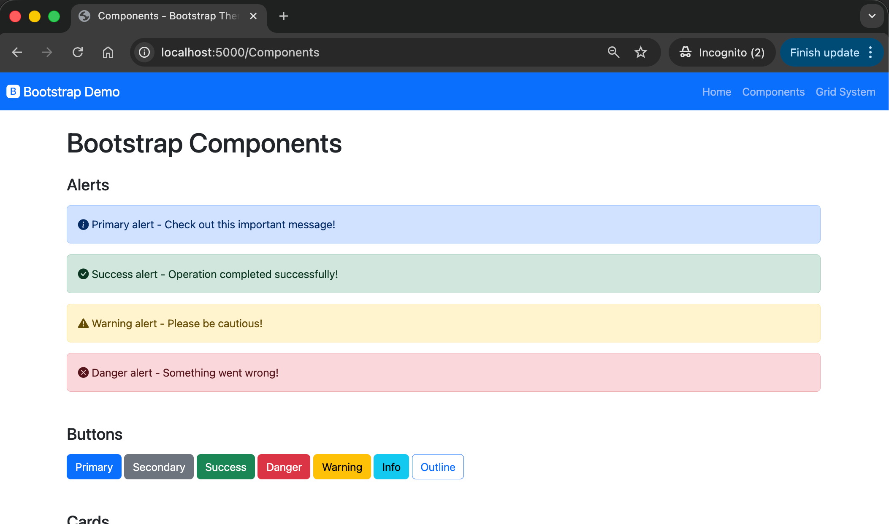
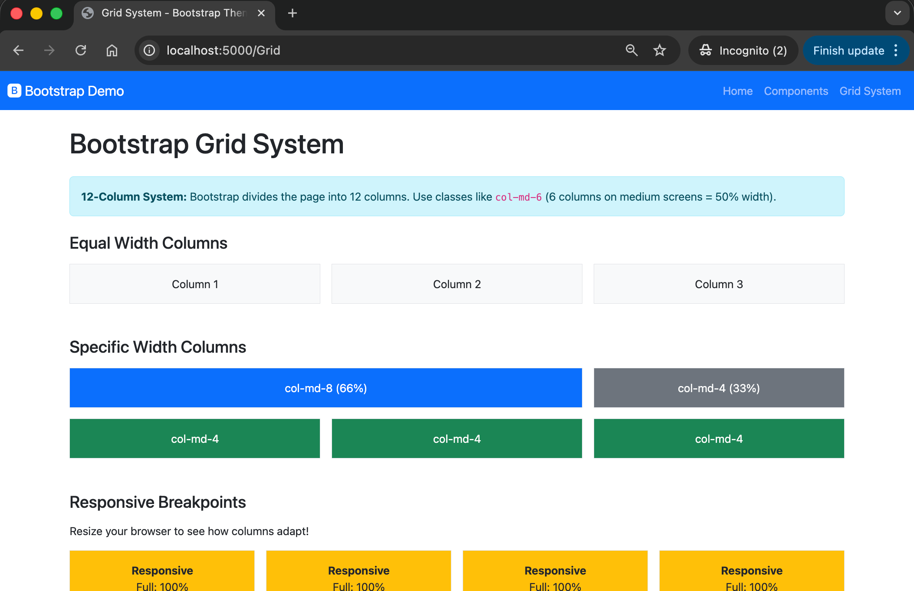
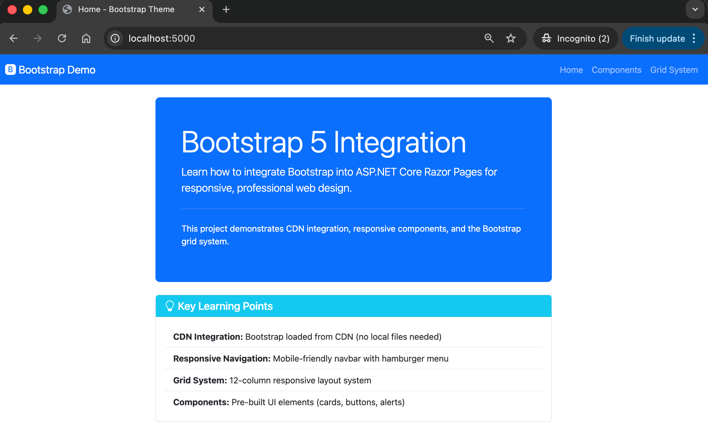

# Bootstrap Theme - FR2: CSS Framework Integration

## Overview

This project demonstrates how to integrate **Bootstrap 5** into ASP.NET Core Razor Pages to create responsive, professional-looking websites with minimal custom CSS.

## Screenshot(s)

  

## Learning Objectives

- Integrate Bootstrap 5 via CDN
- Create responsive navigation with hamburger menu
- Use Bootstrap's 12-column grid system
- Apply pre-built components (cards, alerts, buttons, forms)
- Understand CDN vs local file integration

## Key Concepts

### Bootstrap 5 Integration

**CDN Approach** (used in this project):
```html
<!-- In _Layout.cshtml <head> -->
<link href="https://cdn.jsdelivr.net/npm/bootstrap@5.3.2/dist/css/bootstrap.min.css" rel="stylesheet">

<!-- Before closing </body> -->
<script src="https://cdn.jsdelivr.net/npm/bootstrap@5.3.2/dist/js/bootstrap.bundle.min.js"></script>
```

**Benefits**: Fast loading, browser caching, no local files, automatic updates

**Alternative**: Download Bootstrap to `wwwroot/lib/bootstrap/` for offline use

### Responsive Navigation

```html
<nav class="navbar navbar-expand-lg navbar-dark bg-primary">
    <button class="navbar-toggler" data-bs-toggle="collapse" data-bs-target="#navbarNav">
        <span class="navbar-toggler-icon"></span>
    </button>
    <div class="collapse navbar-collapse" id="navbarNav">
        <!-- Nav items here -->
    </div>
</nav>
```

- **Desktop**: Full horizontal menu
- **Mobile**: Hamburger menu (≤ 992px)

### Grid System Basics

| Class | Breakpoint | Screen Width |
|-------|------------|--------------|
| `col-` | Extra small | < 576px |
| `col-sm-` | Small | ≥ 576px |
| `col-md-` | Medium | ≥ 768px |
| `col-lg-` | Large | ≥ 992px |

**Example**:
```html
<div class="row">
    <div class="col-md-8">Main content (66%)</div>
    <div class="col-md-4">Sidebar (33%)</div>
</div>
```

### Common Components

- **Alerts**: `alert alert-primary`, `alert-success`, `alert-danger`
- **Buttons**: `btn btn-primary`, `btn-outline-secondary`
- **Cards**: `card`, `card-body`, `card-title`
- **Forms**: `form-control`, `form-label`, `form-check`

## Project Structure

```
02.BootstrapTheme/
├── Pages/
│   ├── Index.cshtml          # Home page with hero section
│   ├── Components.cshtml     # Bootstrap component showcase
│   ├── Grid.cshtml           # Grid system examples
│   └── Shared/
│       └── _Layout.cshtml    # Layout with Bootstrap CDN links
├── BootstrapTheme.csproj
├── Program.cs
└── README.md
```

## What's Different from BasicLayout?

| Aspect | BasicLayout | BootstrapTheme |
|--------|-------------|----------------|
| CSS Framework | None (custom CSS) | Bootstrap 5 via CDN |
| Navigation | Simple links | Responsive navbar |
| Layout | Basic HTML structure | Bootstrap grid system |
| Components | Plain HTML | Pre-styled components |
| Mobile Support | Minimal | Fully responsive |

## Quick Reference

### Bootstrap Utilities

- **Spacing**: `m-3` (margin), `p-4` (padding), `mt-2` (margin-top)
- **Colors**: `text-primary`, `bg-success`, `border-danger`
- **Display**: `d-flex`, `d-none`, `d-md-block`
- **Text**: `text-center`, `fw-bold`, `fs-4`

### Icon Integration

This project uses **Bootstrap Icons**:
```html
<!-- In _Layout.cshtml -->
<link rel="stylesheet" href="https://cdn.jsdelivr.net/npm/bootstrap-icons@1.11.2/font/bootstrap-icons.min.css">

<!-- Usage -->
<i class="bi bi-bootstrap-fill"></i>
```

## Next Steps

1. Run the project and resize your browser to see responsive behavior
2. Inspect the navbar on mobile (< 992px width)
3. Explore [Components page](/Components) for more examples
4. Review [Grid page](/Grid) to understand the layout system
5. Visit [Bootstrap documentation](https://getbootstrap.com/docs/5.3/) for full reference

## Resources

- [Bootstrap 5 Documentation](https://getbootstrap.com/docs/5.3/)
- [Bootstrap Icons](https://icons.getbootstrap.com/)
- [Bootstrap CDN](https://www.bootstrapcdn.com/)
