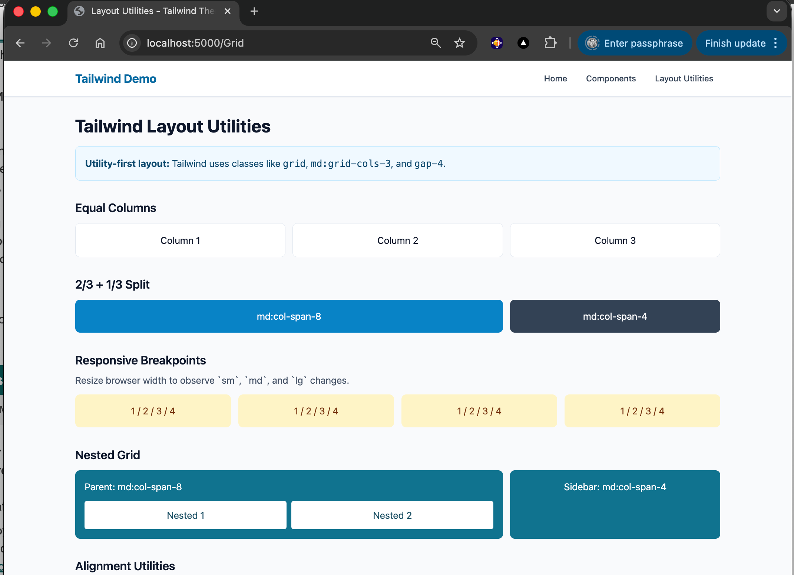
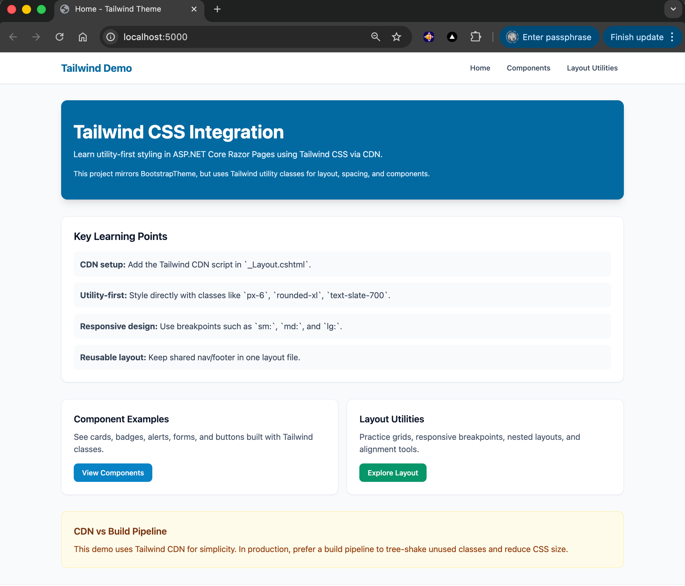
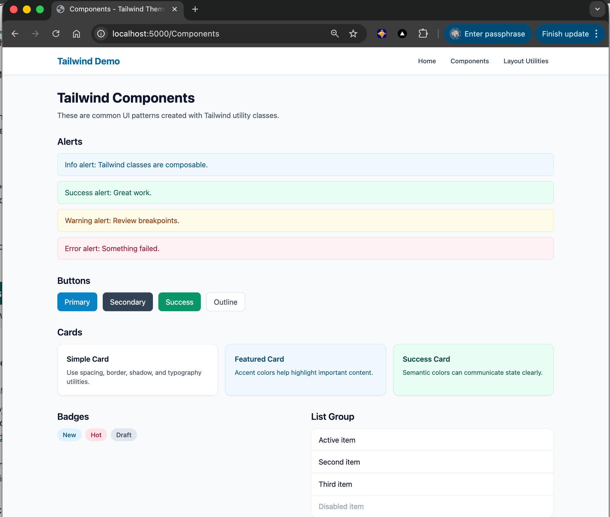

# Tailwind Theme - FR2: CSS Framework Integration

## Overview

This project demonstrates **Tailwind CSS** integration in ASP.NET Core Razor Pages using a utility-first approach.

## Screenshots

  

## Learning Objectives

- Integrate Tailwind CSS via CDN
- Build responsive pages with breakpoint prefixes (`sm:`, `md:`, `lg:`)
- Create common UI components with utility classes
- Compare utility-first styling with Bootstrap components

## Key Concepts

### Tailwind CDN Setup

```html
<script src="https://cdn.tailwindcss.com"></script>
```

### Utility-First Styling

```html
<div class="rounded-xl bg-white p-6 shadow-sm">...</div>
```

### Responsive Design

```html
<div class="grid grid-cols-1 sm:grid-cols-2 md:grid-cols-3 lg:grid-cols-4">...</div>
```

## Project Structure

```text
03.TailwindTheme/
+-- Pages/
|   +-- Index.cshtml          # Tailwind overview and quick links
|   +-- Components.cshtml     # Common UI patterns
|   +-- Grid.cshtml           # Layout and breakpoint examples
|   `-- Shared/_Layout.cshtml # Layout with Tailwind CDN
+-- docs/Key-Takeaways.md
+-- QUICKSTART.md
`-- TailwindTheme.csproj
```

## Next Steps

1. Run the project and inspect classes in browser devtools
2. Compare this project with `02.BootstrapTheme`
3. Try changing spacing, colors, and breakpoints
