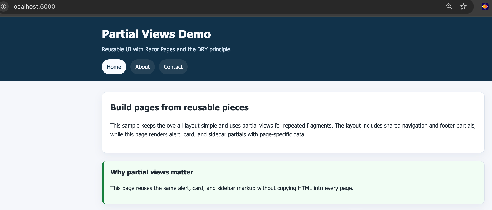

# Partial Views

## Overview

This project teaches how to extract repeated UI into Razor partial views. It keeps the same simple Razor Pages structure as `01.BasicLayout`, but replaces duplicated navigation, footer, alerts, cards, and sidebar markup with reusable partials.

DRY: Don't Repeat Yourself. If you find yourself copying and pasting the same HTML in multiple places, it's a good sign that you should create a partial view instead. Partials let you define a piece of UI once and reuse it across multiple pages, making your code cleaner and easier to maintain.

## Screenshot

## Learning Objectives

- Create reusable partial views in `Pages/Shared`
- Render partials with the `<partial>` tag helper
- Pass strongly typed data into partials
- Decide when a partial is a better choice than copy/paste markup
- Apply DRY principles to common page fragments

## Key Concepts

- `_Layout.cshtml` still owns the page shell
- `_Navigation.cshtml` and `_Footer.cshtml` keep shared chrome reusable
- `_Alert.cshtml`, `_FeatureCard.cshtml`, and `_Sidebar.cshtml` show partials with models
- `_ViewImports.cshtml` enables the tag helpers needed for `<partial>`

## Included Partials

Under `Pages/Shared`, this project includes the following partial views:

- `_Navigation.cshtml`
- `_Footer.cshtml`
- `_Alert.cshtml`
- `_FeatureCard.cshtml`
- `_Sidebar.cshtml`
