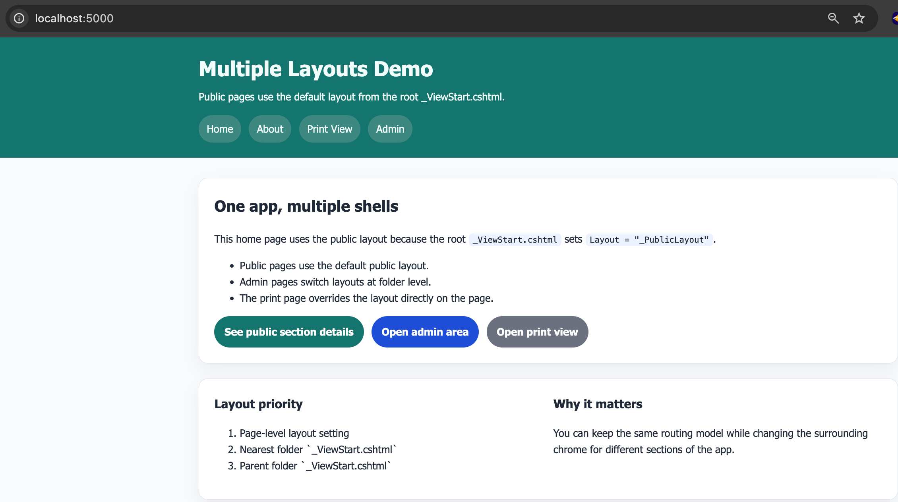

# Multiple Layouts

## Overview

This project shows how one Razor Pages app can use different layouts for different parts of the site. It includes a public layout, an admin layout, and a print layout.

# Screenshot

## Learning Objectives

- Create more than one layout file in `Pages/Shared`
- Use root and folder-level `_ViewStart.cshtml` files
- Override the layout at page level when needed
- Understand layout selection priority in Razor Pages

## Key Concepts

- Root `_ViewStart.cshtml` sets the default public layout
- `Pages/Admin/_ViewStart.cshtml` switches all admin pages to the admin layout
- `Print.cshtml` overrides the layout directly on the page
- `@RenderSection()` keeps page-specific tools and notes optional
