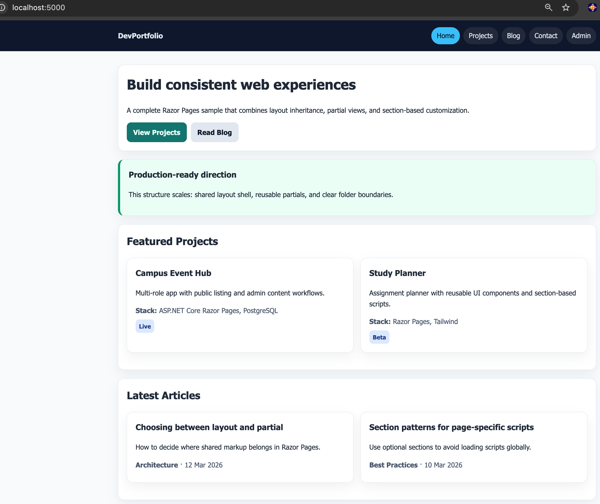
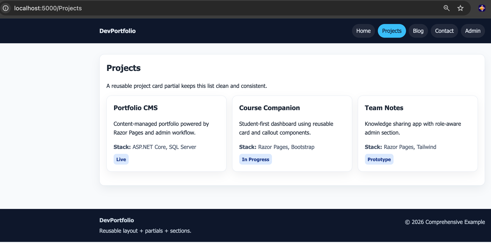

# Comprehensive Example

## Overview

This project combines the module concepts in one production-style Razor Pages app (portfolio + blog). It uses multiple layouts, reusable partials, sections, and DRY-first structure.

## Screenshot

## Learning Objectives

- Build a real-world multi-page app with shared layouts
- Reuse UI through partial views with typed models
- Apply folder-level and page-level layout overrides
- Keep page code focused by extracting repeated fragments

## Key Concepts

- Public, admin, and print layouts
- Shared partials for navigation, footer, hero, project cards, post cards, and callouts
- Optional sections with `@RenderSection()` and `IsSectionDefined()`
- Consistent design and structure without duplicated page shell markup
