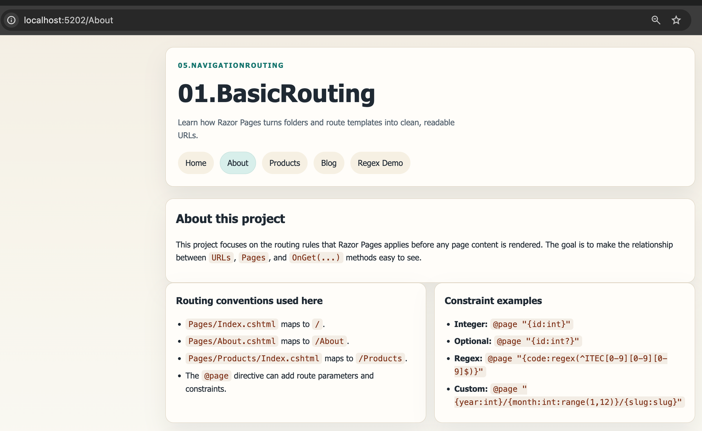
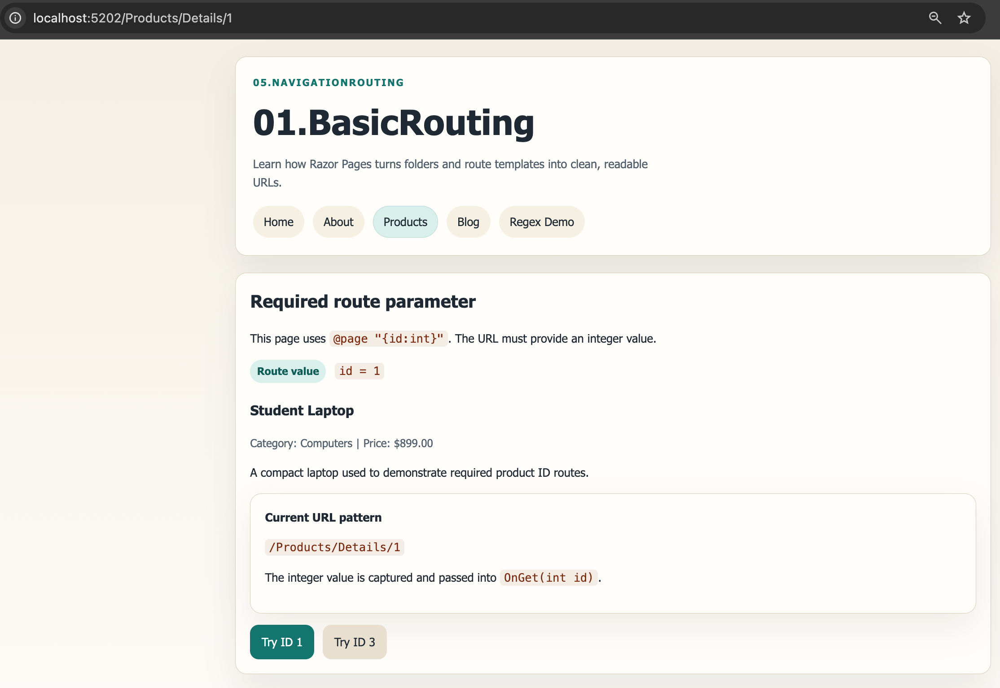
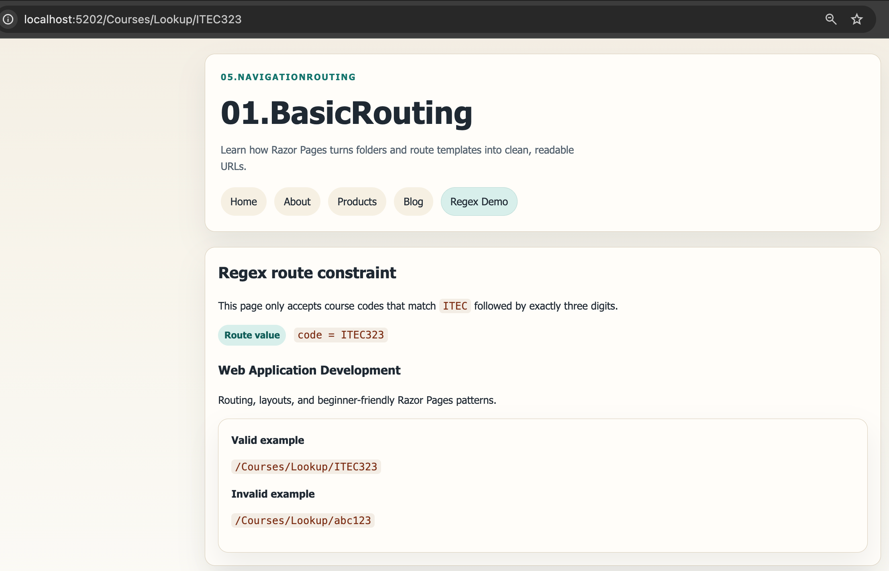

# 01.BasicRouting - Understanding Endpoint Routing

## Overview

This project introduces the **routing fundamentals of ASP.NET Core Razor Pages**. Students can see how URLs map to files in the `Pages` folder, how route parameters are captured, and how constraints help validate route values before the page runs.


## Screenshot

  

## Learning Objectives

By completing this project, you will:

1. Understand how folder-based routing maps URLs to Razor Pages.
2. Use required route parameters such as `@page "{id:int}"`.
3. Use optional route parameters such as `@page "{id:int?}"`.
4. Apply route constraints including `int`, `regex`, and a custom `slug` constraint.
5. Build friendly URLs for products and blog posts.

## What This Project Demonstrates

- `/` maps to `Pages/Index.cshtml`
- `/About` maps to `Pages/About.cshtml`
- `/Products` maps to `Pages/Products/Index.cshtml`
- `/Products/Details/2` maps to `Pages/Products/Details.cshtml` with `id = 2`
- `/Products/Edit` and `/Products/Edit/2` both map to `Pages/Products/Edit.cshtml`
- `/Blog/2026/3/getting-started-with-routing` maps to `Pages/Blog/Post.cshtml`
- `/Courses/Lookup/ITEC323` maps to `Pages/Courses/Lookup.cshtml` when the value matches the regex pattern

## Project Structure

```text
01.BasicRouting/
├── 01.BasicRouting.csproj
├── Program.cs
├── README.md
├── QUICKSTART.md
├── docs/
│   └── Key-Takeaways.md
├── Models/
│   ├── BlogPost.cs
│   ├── CourseReference.cs
│   ├── DemoData.cs
│   └── Product.cs
├── Routing/
│   └── SlugRouteConstraint.cs
├── Pages/
│   ├── About.cshtml
│   ├── About.cshtml.cs
│   ├── Index.cshtml
│   ├── Index.cshtml.cs
│   ├── Courses/
│   │   ├── Lookup.cshtml
│   │   └── Lookup.cshtml.cs
│   ├── Blog/
│   │   ├── Index.cshtml
│   │   ├── Index.cshtml.cs
│   │   ├── Post.cshtml
│   │   └── Post.cshtml.cs
│   ├── Products/
│   │   ├── Index.cshtml
│   │   ├── Index.cshtml.cs
│   │   ├── Details.cshtml
│   │   ├── Details.cshtml.cs
│   │   ├── Edit.cshtml
│   │   └── Edit.cshtml.cs
│   └── Shared/
│       └── _Layout.cshtml
└── wwwroot/
    └── css/
        └── site.css
```

## Key Concepts

### 1. Convention-Based Routing

Razor Pages starts with the file path under `Pages`.

- `Pages/About.cshtml` becomes `/About`
- `Pages/Products/Index.cshtml` becomes `/Products`
- `Pages/Blog/Post.cshtml` can become a custom route with `@page "{year:int}/{month:int}/{slug:slug}"`

### 2. Route Parameters

Route parameters let the URL carry data.

```csharp
@page "{id:int}"
```

If the user visits `/Products/Details/5`, the `id` value is passed into the page model.

### 3. Optional Parameters

Optional parameters end with `?`.

```csharp
@page "{id:int?}"
```

This means both `/Products/Edit` and `/Products/Edit/5` are valid.

### 4. Route Constraints

This project demonstrates three kinds of constraints:

- `int` for product IDs
- `regex(...)` for course codes such as `ITEC323`
- `slug` as a custom constraint for blog post slugs such as `getting-started-with-routing`

## Why Friendly URLs Matter

Friendly URLs are easier to read and explain.

- Better: `/Blog/2026/3/getting-started-with-routing`
- Less descriptive: `/Blog/Post?id=12`

Friendly URLs are useful for search engines, bookmarks, and general readability.

## Prerequisites

- .NET 10.0 SDK
- Basic understanding of Razor Pages
- Terminal and code editor

## Next Step

After this project, move to `02.TagHelpers` to learn how to generate these URLs dynamically instead of writing them by hand.
