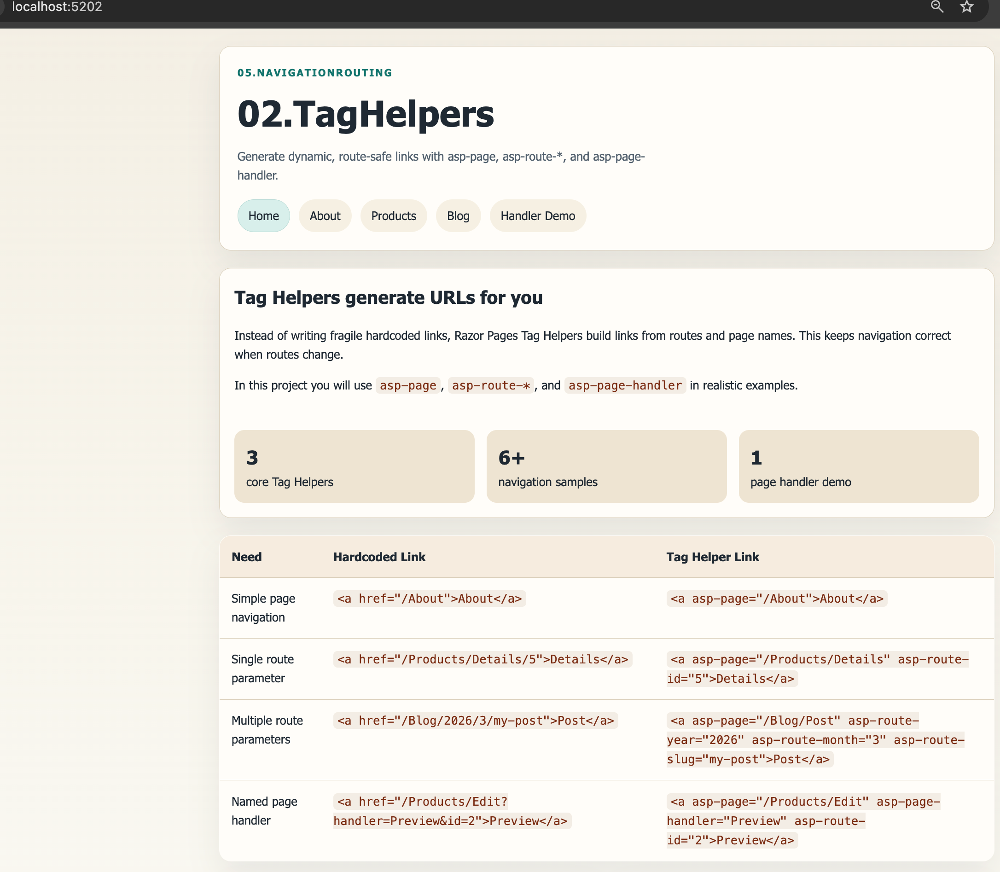

# 02.TagHelpers - Dynamic URL Generation with Razor Pages

## Overview

This project focuses on **navigation Tag Helpers** in ASP.NET Core Razor Pages.
Students learn how to generate maintainable links with:

- `asp-page`
- `asp-route-*`
- `asp-page-handler`

The project mirrors `01.BasicRouting` structure and reuses its route examples so students can compare static URL writing with dynamic URL generation.


## Screenshot



## Learning Objectives

By completing this project, you will:

1. Use `asp-page="/About"` instead of hardcoded `href="/About"`.
2. Pass route parameters with `asp-route-id="5"`.
3. Pass multiple route parameters (`asp-route-year`, `asp-route-month`, `asp-route-slug`).
4. Use `asp-page-handler` to call named handlers without manually writing query strings.
5. Highlight active links in shared navigation.

## What This Project Demonstrates

- Dynamic page links in shared layout navigation.
- Product links built with `asp-page` + `asp-route-id`.
- Blog links built with multiple `asp-route-*` values.
- Handler links built with `asp-page-handler`.
- Route-aware UI that survives route/template changes better than hardcoded links.

## Project Structure

```text
02.TagHelpers/
├── 02.TagHelpers.csproj
├── Program.cs
├── README.md
├── QUICKSTART.md
├── docs/
│   └── Key-Takeaways.md
├── Models/
│   ├── BlogPost.cs
│   ├── CourseReference.cs
│   ├── DemoData.cs
│   └── Product.cs
├── Routing/
│   └── SlugRouteConstraint.cs
├── Pages/
│   ├── About.cshtml
│   ├── Index.cshtml
│   ├── Blog/
│   │   ├── Index.cshtml
│   │   └── Post.cshtml
│   ├── Products/
│   │   ├── Index.cshtml
│   │   ├── Details.cshtml
│   │   └── Edit.cshtml
│   └── Shared/
│       └── _Layout.cshtml
└── wwwroot/
    └── css/
        └── site.css
```

## Key Tag Helper Patterns

### 1. `asp-page`

```html
<a asp-page="/About">About</a>
```

### 2. `asp-route-*` (single parameter)

```html
<a asp-page="/Products/Details" asp-route-id="5">View Product</a>
```

### 3. `asp-route-*` (multiple parameters)

```html
<a asp-page="/Blog/Post"
   asp-route-year="2026"
   asp-route-month="3"
   asp-route-slug="getting-started-with-routing">
    Read Post
</a>
```

### 4. `asp-page-handler`

```html
<a asp-page="/Products/Edit" asp-page-handler="Preview" asp-route-id="2">Preview</a>
```

This calls `OnGetPreview(int id)` in the page model.

## Why Tag Helpers Are Better Than Hardcoded URLs

- Reduce broken links when routes change.
- Make route values explicit and safer.
- Keep Razor markup consistent and readable.
- Integrate naturally with Razor Pages handlers.

## Prerequisites

- .NET 10.0 SDK
- Basic Razor Pages knowledge
- Completion of `01.BasicRouting` (recommended)

## Next Step

Move to `03.NavigationMenus` to build responsive Bootstrap menus using these Tag Helper patterns.
