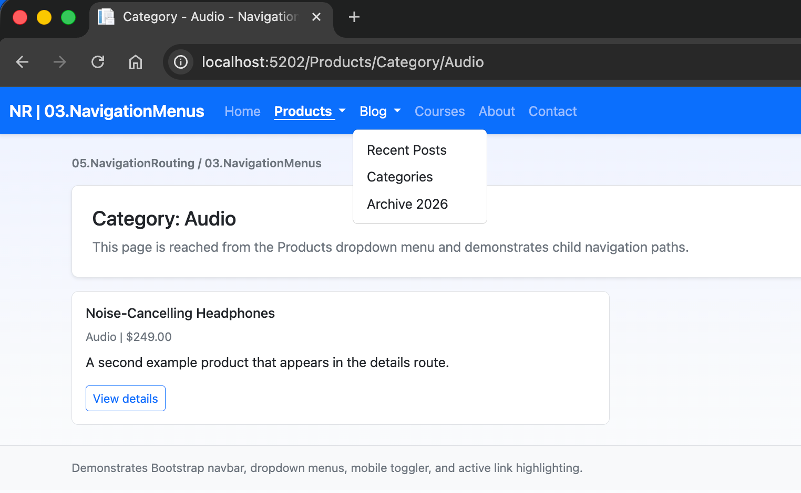
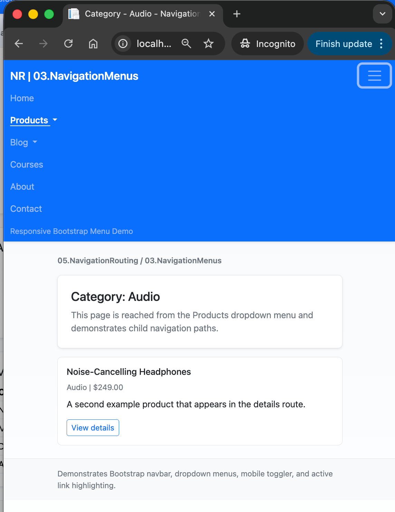

# 03.NavigationMenus - Bootstrap Navigation in Razor Pages

## Overview

This project implements **FR3: Navigation Menus with Bootstrap**.
It demonstrates how to build a responsive top navigation bar with dropdown menus,
active link highlighting, and mobile collapse behavior using Razor Pages.

## Screenshots

 


## Learning Objectives

By completing this project, students will be able to:

1. Build a Bootstrap navbar with brand, links, and dropdowns.
2. Group pages under menu categories (parent > child).
3. Use a hamburger toggler for mobile navigation.
4. Highlight the active page/section in the navbar.
5. Combine Bootstrap components with Razor Pages Tag Helpers.

## FR3 Acceptance Criteria Mapping

- Bootstrap navbar with dropdown menus: implemented in shared layout.
- Responsive hamburger menu on mobile: `navbar-toggler` + collapse target.
- Active link highlighting: route-based helper methods in layout.
- Multi-level grouped navigation: Products and Blog dropdown groups.
- Desktop/mobile compatibility: Bootstrap responsive classes and collapse behavior.

## Project Structure

```text
03.NavigationMenus/
├── 03.NavigationMenus.csproj
├── Program.cs
├── README.md
├── QUICKSTART.md
├── docs/
│   └── Key-Takeaways.md
├── Pages/
│   ├── Index.cshtml
│   ├── About.cshtml
│   ├── Contact.cshtml
│   ├── Products/
│   │   ├── Index.cshtml
│   │   ├── Category.cshtml
│   │   ├── Details.cshtml
│   │   └── Edit.cshtml
│   ├── Blog/
│   │   ├── Index.cshtml
│   │   ├── Categories.cshtml
│   │   ├── Archive.cshtml
│   │   └── Post.cshtml
│   └── Shared/
│       └── _Layout.cshtml
└── wwwroot/
    └── css/
        └── site.css
```

## Menu Configuration in This Project

Top-level items:

1. Home
2. Products (dropdown)
3. Blog (dropdown)
4. Courses
5. About
6. Contact

Dropdown groups:

- Products: All Products, Computers, Audio, Accessories
- Blog: Recent Posts, Categories, Archive 2026

## Key Implementation Notes

- Uses `asp-page` and `asp-route-*` for menu links.
- Uses route-prefix checks in layout to apply `active` classes.
- Uses Bootstrap 5 classes:
  - `navbar navbar-expand-lg`
  - `navbar-toggler`
  - `dropdown-menu`
  - `container-fluid`

## Prerequisites

- .NET 10.0 SDK
- Basic knowledge of Razor Pages and Bootstrap utility classes

## Next Step

Move to `04.Breadcrumbs` to add hierarchical breadcrumbs that reflect the current route context.
