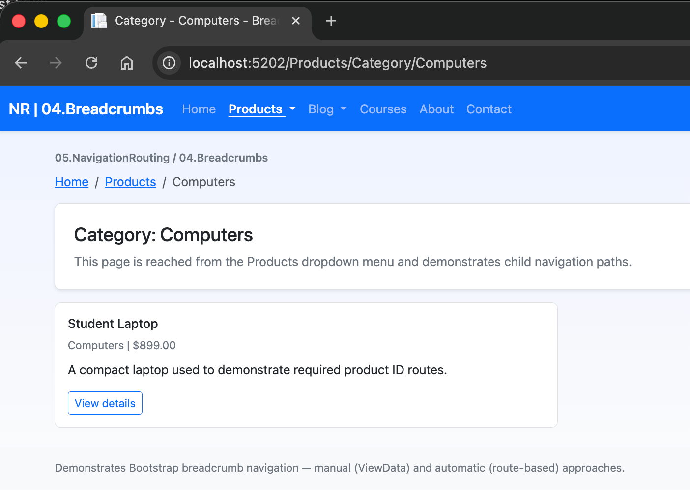

# 04.Breadcrumbs

# Screenshot



## Learning Objectives

After studying this project you will be able to:

1. Render a Bootstrap breadcrumb component with correct accessible markup.
2. Pass a custom breadcrumb trail from a PageModel using `ViewData["Breadcrumbs"]` (manual approach).
3. Generate breadcrumbs automatically from the URL path as a layout-level fallback (automatic approach).
4. Choose the right approach for each page based on the complexity of the route.
5. Use `aria-label="breadcrumb"` and `aria-current="page"` for screen-reader support.

---

## FR4 Acceptance Criteria

| Criterion | Where demonstrated |
|---|---|
| Bootstrap `<ol class="breadcrumb">` component | `Pages/Shared/_Layout.cshtml` |
| Manual trail via `ViewData["Breadcrumbs"]` | All Products and Blog PageModels |
| Automatic trail from URL segments (fallback) | About, Contact — any page without manual crumbs |
| At least 5 pages with breadcrumbs | 8 pages covered |
| `aria-label="breadcrumb"` on wrapping `<nav>` | `_Layout.cshtml` breadcrumb strip |
| `aria-current="page"` on active crumb | `_Layout.cshtml` breadcrumb rendering loop |

---

## Project Structure

```
04.Breadcrumbs/
├── 04.Breadcrumbs.csproj          # net10.0, RootNamespace=Breadcrumbs
├── Program.cs                     # Registers SlugRouteConstraint, maps Razor Pages
├── Models/
│   ├── BreadcrumbItem.cs          # NEW: Text, Url, IsActive properties
│   ├── BlogPost.cs
│   ├── Product.cs
│   ├── CourseReference.cs
│   └── DemoData.cs
├── Pages/
│   ├── Shared/
│   │   └── _Layout.cshtml         # Navbar + breadcrumb strip (manual & auto)
│   ├── Index.cshtml               # FR4 overview with sample trail links
│   ├── About.cshtml               # Auto-generated crumb fallback demo
│   ├── Contact.cshtml             # Auto-generated crumb fallback demo
│   ├── Products/
│   │   ├── Index.cshtml           # Home > Products
│   │   ├── Details.cshtml         # Home > Products > {Product Name}  (3 levels)
│   │   ├── Category.cshtml        # Home > Products > {Category}      (3 levels)
│   │   └── Edit.cshtml            # Home > Products > {Name} > Edit   (4 levels)
│   └── Blog/
│       ├── Index.cshtml           # Home > Blog
│       ├── Categories.cshtml      # Home > Blog > Categories          (3 levels)
│       ├── Archive.cshtml         # Home > Blog > Archive > {Year}    (4 levels)
│       └── Post.cshtml            # Home > Blog > {Year} > {Month} > {Title} (5 levels)
├── Routing/
│   └── SlugRouteConstraint.cs
└── wwwroot/
  └── css/site.css
```

---

## Two Breadcrumb Approaches

### Approach 1 — Manual (ViewData)

Set the trail explicitly in the PageModel's `OnGet()` method:

```csharp
// Pages/Products/Details.cshtml.cs
public IActionResult OnGet(int id)
{
  Product = DemoData.FindProduct(id);
  if (Product is null) return NotFound();

  ViewData["Breadcrumbs"] = new List<BreadcrumbItem>
  {
    new() { Text = "Home",         Url = "/" },
    new() { Text = "Products",     Url = "/Products" },
    new() { Text = Product.Name,   IsActive = true }
  };
  return Page();
}
```

**When to use**: when segment labels need real data (product names, post titles, month names).

### Approach 2 — Automatic (Route-based fallback)

The shared layout derives crumbs from the URL path when `ViewData["Breadcrumbs"]` is not set:

```csharp
// Inside _Layout.cshtml @{ ... } block
IList<BreadcrumbItem> BuildAutoCrumbs()
{
  var segments = currentPath.Trim('/').Split('/', ...);
  // "About" → Home > About
  // "Courses/Lookup" → Home > Courses > Lookup
}
var breadcrumbs = manualCrumbs ?? BuildAutoCrumbs();
```

**When to use**: simple pages where the URL segment is a good enough label.

---

## Bootstrap Breadcrumb Markup

```html
<nav aria-label="breadcrumb">
  <ol class="breadcrumb">
    <li class="breadcrumb-item"><a href="/">Home</a></li>
    <li class="breadcrumb-item"><a href="/Products">Products</a></li>
    <li class="breadcrumb-item active" aria-current="page">Student Laptop</li>
  </ol>
</nav>
```

Bootstrap styles the separator (›) automatically via CSS `::before` on `.breadcrumb-item + .breadcrumb-item`.

---

## BreadcrumbItem Model

```csharp
public class BreadcrumbItem
{
  public string  Text     { get; set; } = string.Empty;
  public string? Url      { get; set; }   // null = render as plain text
  public bool    IsActive { get; set; }   // adds aria-current="page"
}
```

---

## Prerequisites

- .NET 10 SDK (`dotnet --version`)
- No database or additional tooling required

---

## Running the project

```bash
cd 05.NavigationRouting
dotnet run --project 04.Breadcrumbs/04.Breadcrumbs.csproj
```

Then open <https://localhost:5001> (or the port shown in terminal output).

---

## Next Step

➜ **05.SidebarNavigation** — fixed/sticky sidebars with collapsible sections and Bootstrap Offcanvas.

## Overview

This project implements **FR3: Navigation Menus with Bootstrap**.
It demonstrates how to build a responsive top navigation bar with dropdown menus,
active link highlighting, and mobile collapse behavior using Razor Pages.

## Screenshots

 


## Learning Objectives

By completing this project, students will be able to:

1. Build a Bootstrap navbar with brand, links, and dropdowns.
2. Group pages under menu categories (parent > child).
3. Use a hamburger toggler for mobile navigation.
4. Highlight the active page/section in the navbar.
5. Combine Bootstrap components with Razor Pages Tag Helpers.

## FR3 Acceptance Criteria Mapping

- Bootstrap navbar with dropdown menus: implemented in shared layout.
- Responsive hamburger menu on mobile: `navbar-toggler` + collapse target.
- Active link highlighting: route-based helper methods in layout.
- Multi-level grouped navigation: Products and Blog dropdown groups.
- Desktop/mobile compatibility: Bootstrap responsive classes and collapse behavior.

## Project Structure

```text
03.NavigationMenus/
├── 03.NavigationMenus.csproj
├── Program.cs
├── README.md
├── QUICKSTART.md
├── docs/
│   └── Key-Takeaways.md
├── Pages/
│   ├── Index.cshtml
│   ├── About.cshtml
│   ├── Contact.cshtml
│   ├── Products/
│   │   ├── Index.cshtml
│   │   ├── Category.cshtml
│   │   ├── Details.cshtml
│   │   └── Edit.cshtml
│   ├── Blog/
│   │   ├── Index.cshtml
│   │   ├── Categories.cshtml
│   │   ├── Archive.cshtml
│   │   └── Post.cshtml
│   └── Shared/
│       └── _Layout.cshtml
└── wwwroot/
    └── css/
        └── site.css
```

## Menu Configuration in This Project

Top-level items:

1. Home
2. Products (dropdown)
3. Blog (dropdown)
4. Courses
5. About
6. Contact

Dropdown groups:

- Products: All Products, Computers, Audio, Accessories
- Blog: Recent Posts, Categories, Archive 2026

## Key Implementation Notes

- Uses `asp-page` and `asp-route-*` for menu links.
- Uses route-prefix checks in layout to apply `active` classes.
- Uses Bootstrap 5 classes:
  - `navbar navbar-expand-lg`
  - `navbar-toggler`
  - `dropdown-menu`
  - `container-fluid`

## Prerequisites

- .NET 10.0 SDK
- Basic knowledge of Razor Pages and Bootstrap utility classes

## Next Step

Move to `04.Breadcrumbs` to add hierarchical breadcrumbs that reflect the current route context.
