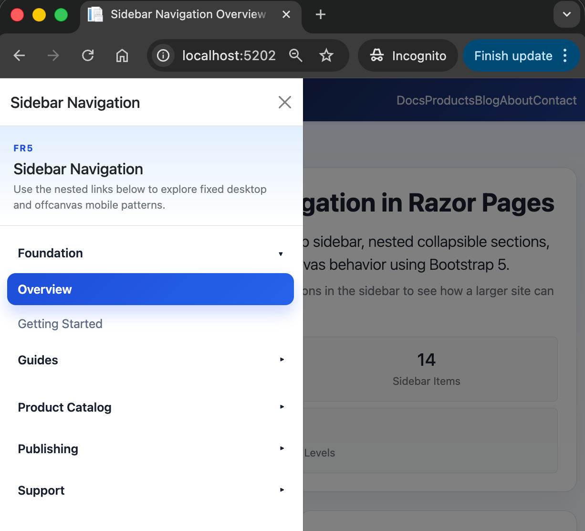
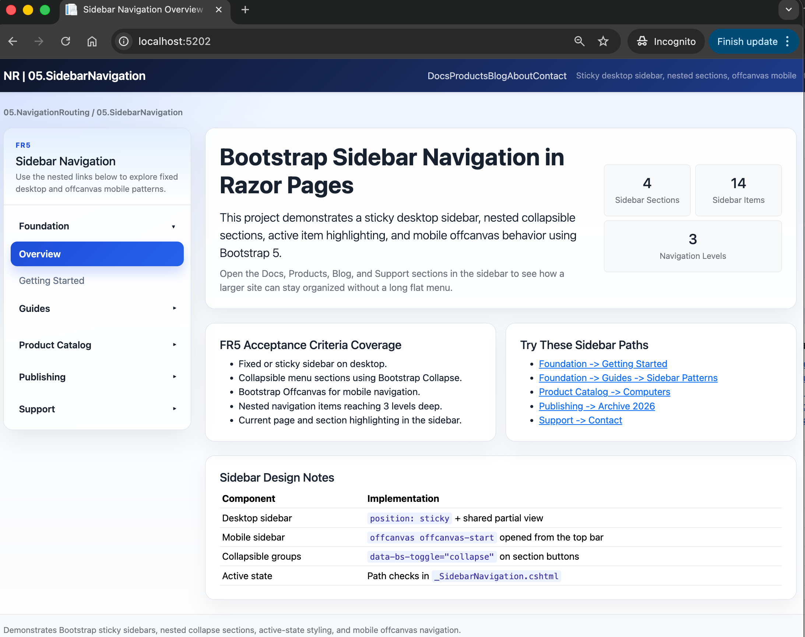

# 05.SidebarNavigation

## Overview

This project demonstrates how to build a sticky desktop sidebar, collapsible navigation groups,
three-level nested links, active item highlighting, and a Bootstrap Offcanvas sidebar for mobile devices.

## Screenshots

 

## Learning Objectives

After studying this project you will be able to:

1. Build a fixed or sticky sidebar for a Razor Pages application.
2. Group links into collapsible sections with Bootstrap Collapse.
3. Reuse the same navigation structure in a mobile Offcanvas panel.
4. Highlight the active page and keep the current section expanded.
5. Organize larger sites with 2 to 3 levels of navigation depth.

## FR5 Acceptance Criteria Mapping

| Criterion | Where demonstrated |
|---|---|
| Fixed or sticky sidebar navigation | `Pages/Shared/_SidebarNavigation.cshtml` + `wwwroot/css/site.css` |
| Collapsible menu sections | Section buttons using `data-bs-toggle="collapse"` |
| Bootstrap Offcanvas for mobile | `Pages/Shared/_Layout.cshtml` |
| Nested navigation items (2 to 3 levels) | `Foundation -> Guides -> Sidebar Patterns/Offcanvas Navigation` |
| Active page highlighting | Path-based logic in `_SidebarNavigation.cshtml` |
| Minimum 10 navigation items | 14 links across Foundation, Product Catalog, Publishing, Support |

## Project Structure

```text
05.SidebarNavigation/
├── 05.SidebarNavigation.csproj
├── Program.cs
├── README.md
├── QUICKSTART.md
├── docs/
│   └── Key-Takeaways.md
├── Pages/
│   ├── Index.cshtml
│   ├── About.cshtml
│   ├── Contact.cshtml
│   ├── Docs/
│   │   ├── GettingStarted.cshtml
│   │   └── Guides/
│   │       ├── SidebarPatterns.cshtml
│   │       └── OffcanvasNavigation.cshtml
│   ├── Products/
│   │   ├── Index.cshtml
│   │   ├── Category.cshtml
│   │   ├── Details.cshtml
│   │   └── Edit.cshtml
│   ├── Blog/
│   │   ├── Index.cshtml
│   │   ├── Categories.cshtml
│   │   ├── Archive.cshtml
│   │   └── Post.cshtml
│   └── Shared/
│       ├── _Layout.cshtml
│       └── _SidebarNavigation.cshtml
└── wwwroot/
    └── css/
        └── site.css
```

## Navigation Structure Used in This Project

The sidebar is split into four sections:

1. Foundation
2. Product Catalog
3. Publishing
4. Support

The Foundation section includes a nested `Guides` group, which demonstrates third-level navigation:

`Foundation -> Guides -> Sidebar Patterns`

## Key Implementation Notes

- `_SidebarNavigation.cshtml` centralizes the sidebar markup so the same links are used on desktop and mobile.
- `_Layout.cshtml` renders the sidebar as a sticky desktop panel and as an Offcanvas panel on smaller screens.
- Bootstrap Collapse manages section expansion.
- Active item styling is based on the current request path.
- All links use Razor Pages Tag Helpers such as `asp-page` and `asp-route-*`.

## Prerequisites

- .NET 10 SDK
- Browser for testing desktop and mobile layouts

## Running the project

```bash
cd 05.NavigationRouting
dotnet run
```

Then open the local URL printed in the terminal.

## Next Step

Move to `06.ComprehensiveNavigation` to combine top navigation, breadcrumbs, sidebar navigation, and footer links in one larger application.
