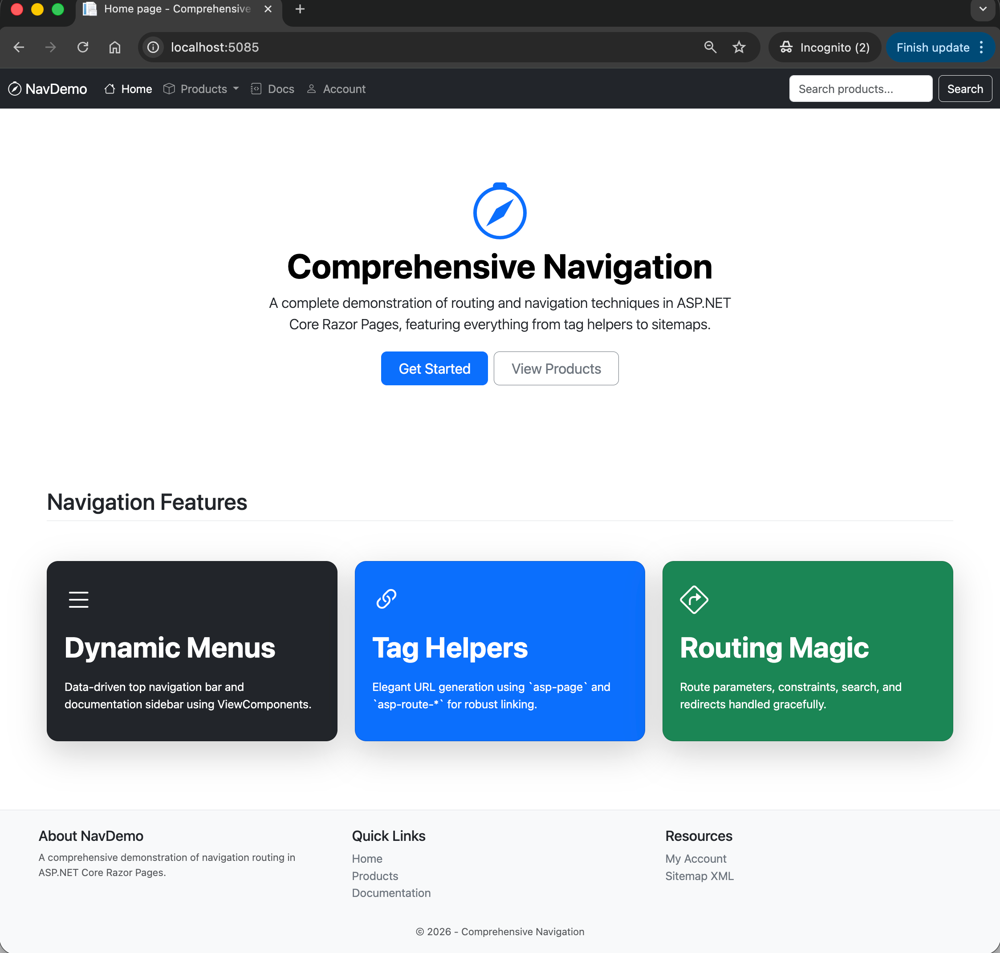

# 06. Comprehensive Navigation

## Overview
This project is part of the **ITEC323** Navigation & Routing module. It serves as the capstone demonstration by combining all fundamental routing and navigation techniques studied in prior modules into a single, cohesive, "real-world" ASP.NET Core Razor Pages application.

## Screenshot 

## Learning Objectives
By exploring this project, you will understand how to:
1. Combine basic endpoint routing with dynamic route parameters (`@page "{id:int}"`).
2. Utilize Tag Helpers (`asp-page`, `asp-route-*`) across various contexts (navbars, grids, lists).
3. Implement reusable **ViewComponents** for dynamic data-driven top navbars, breadcrumbs, and sidebars.
4. Implement nested layouts (e.g., `_DocsLayout.cshtml` wrapping `_Layout.cshtml`).
5. Perform programmatic redirects (301/302) seamlessly (e.g., Admin dashboard to Login redirect).
6. Auto-generate SEO-friendly XML sitemaps using Razor Page models and content results.

## Key Features
- **Dynamic Top Navbar**: Driven by a mock `NavigationService` via a ViewComponent, rendering multi-level dropdown menus.
- **Auto Breadcrumbs**: A ViewComponent that inspects the current HTTP request path and generates breadcrumbs based on segments.
- **Nested Layout Sidebar**: An additional nested layout specific to Documentation pages, offering a left-hand navigation sidebar.
- **Search & Redirect**: Handing form POST requests safely and converting them to GET redirects for cache/history friendly search URLs.
- **Sitemap Generator**: A dedicated `/sitemap.xml` endpoint rendering `application/xml` natively using `XmlWriter`.

## Technologies
- ASP.NET Core 10.0
- Razor Pages
- Bootstrap 5.3 (via default templates)
- C# 14
