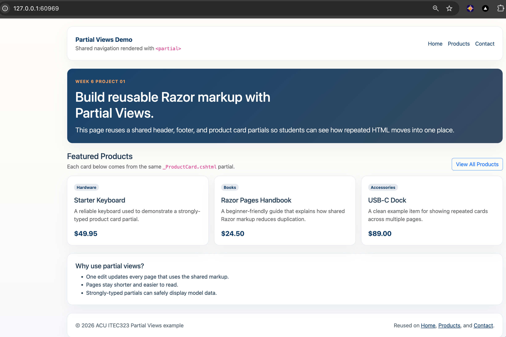

# 01.PartialViews

Simple ASP.NET Core Razor Pages project showing how Partial Views remove repeated HTML.

## Screenshot



## Learning Objectives

- Create shared partials in `Pages/Shared/`
- Render static partials with `<partial name="..." />`
- Pass a model into a partial view
- Reuse the same partials across multiple pages

## What Is Included

- `_Header.cshtml` for shared navigation
- `_Footer.cshtml` for shared footer content
- `_ProductCard.cshtml` for strongly-typed product display
- `_ContactForm.cshtml` for reusable form inputs
- `Index`, `Products`, and `Contact` pages using the partials

## Project Structure

```text
01.PartialViews/
├── Models/
├── Pages/
│   ├── Contact.cshtml
│   ├── Index.cshtml
│   ├── Products.cshtml
│   └── Shared/
├── docs/
├── QUICKSTART.md
└── README.md
```

## Key Idea

If the markup is repeated and does not need its own backend logic, move it into a Partial View.
