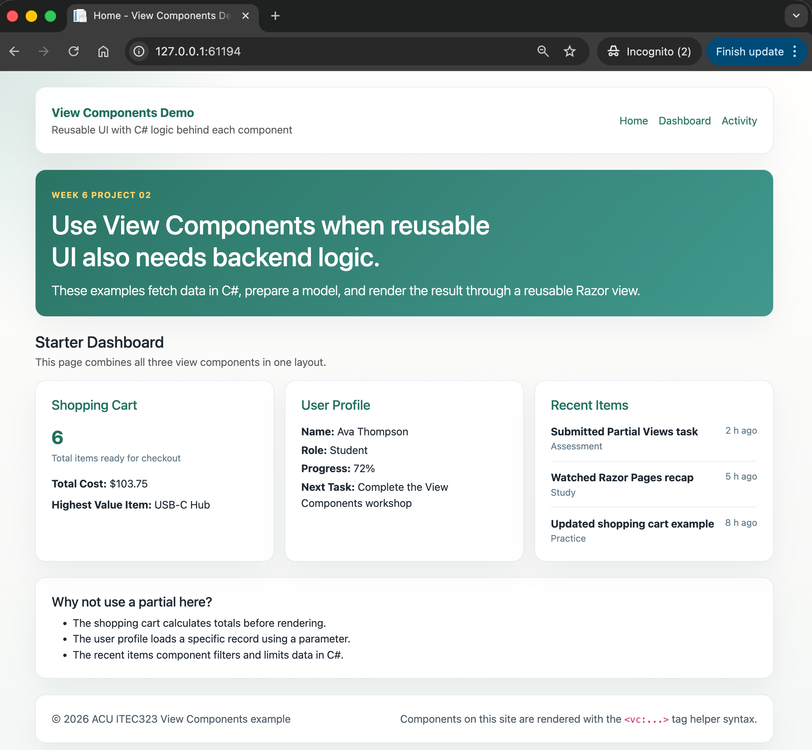

# 02.ViewComponents

Simple ASP.NET Core Razor Pages project showing how View Components combine reusable UI with C# logic.

## Screenshot



## Learning Objectives

- Create View Component classes that inherit from `ViewComponent`
- Build matching Razor views in `Views/Shared/Components/`
- Render components with the `<vc:...></vc:...>` tag helper syntax
- Pass parameters into components to show different data

## What Is Included

- `ShoppingCartViewComponent` for totals and calculations
- `UserProfileViewComponent` for loading one user by `userId`
- `RecentItemsViewComponent` for filtering and limiting activity items
- `Index`, `Dashboard`, and `Activity` pages using the components

## Project Structure

```text
02.ViewComponents/
├── Models/
├── Pages/
├── Services/
├── ViewComponents/
├── Views/Shared/Components/
├── docs/
├── QUICKSTART.md
└── README.md
```

## Key Idea

If reusable UI needs backend logic before it renders, use a View Component instead of a Partial View.
