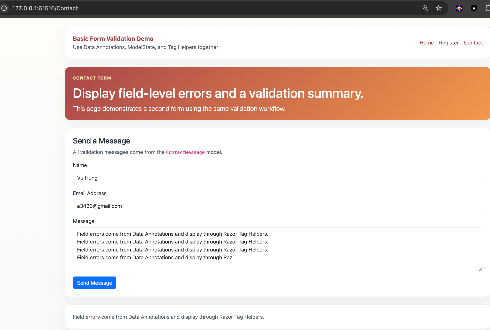
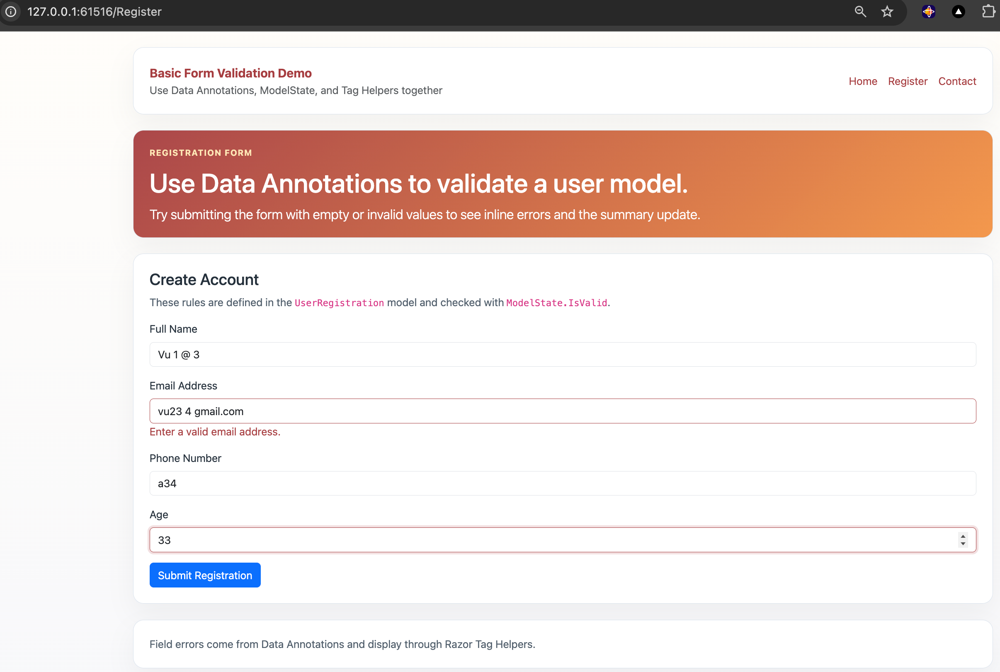

# 03.BasicFormValidation

Simple ASP.NET Core Razor Pages project showing how to validate forms with Data Annotations, ModelState, and Tag Helpers.

## Screenshot

 

## Learning Objectives

- Add validation rules to model properties with Data Annotations
- Display inline errors with `asp-validation-for`
- Display summary errors with `asp-validation-summary`
- Check `ModelState.IsValid` before processing submitted data
- Enable client-side validation with jQuery Validation scripts

## What Is Included

- `UserRegistration` model with `Required`, `StringLength`, `EmailAddress`, `Phone`, `Display`, and `Range`
- `ContactMessage` model with common form validation rules
- `Register` page for a user registration form
- `Contact` page for a message form

## Project Structure

```text
03.BasicFormValidation/
├── Models/
├── Pages/
│   ├── Contact.cshtml
│   ├── Register.cshtml
│   └── Shared/
├── docs/
├── QUICKSTART.md
└── README.md
```

## Key Idea

Validation rules belong in the model, while the page checks `ModelState.IsValid` before accepting the form.
