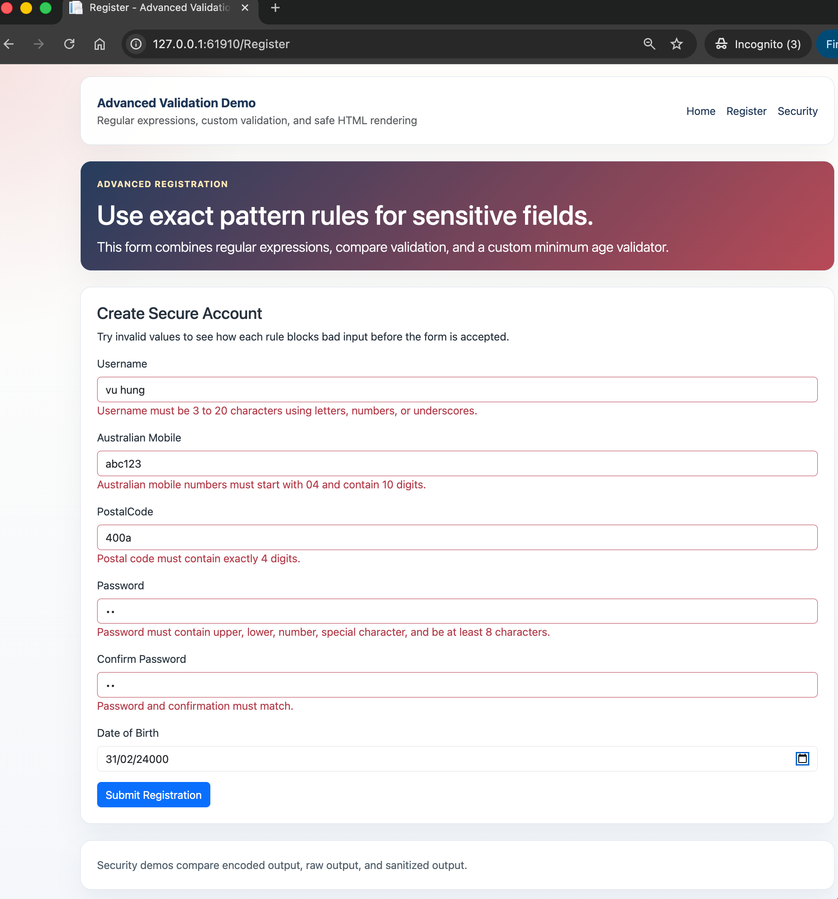
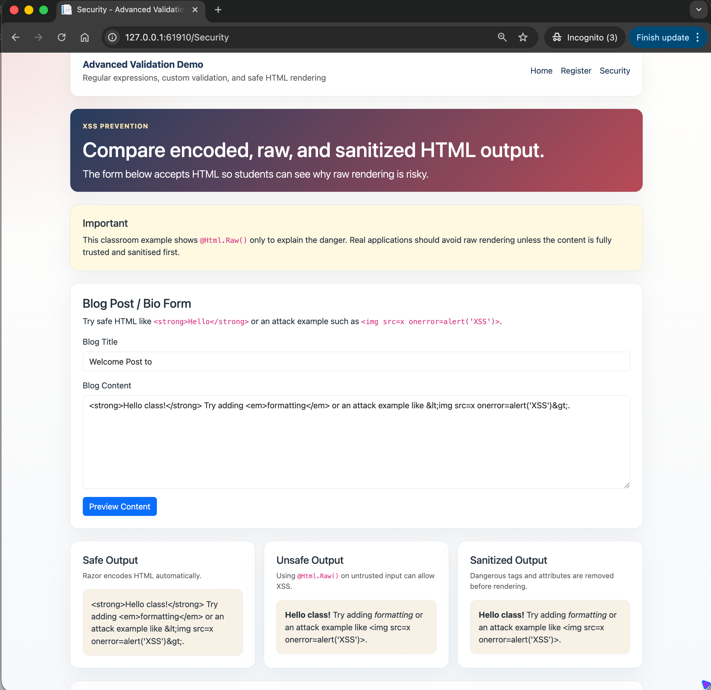

# 04.AdvancedValidation

Simple ASP.NET Core Razor Pages project showing advanced validation rules and basic XSS prevention concepts.

## Screenshots

 

## Learning Objectives

- Use `RegularExpression` for exact input formats
- Use `Compare` to confirm password fields match
- Build a custom `ValidationAttribute` for minimum age rules
- Understand how Razor encodes output by default
- Compare unsafe raw rendering with sanitized HTML rendering

## What Is Included

- `AdvancedUserRegistration` model with 4 regular expression rules, `Compare`, and `MinimumAge`
- `MinimumAgeAttribute` custom validator in `CustomValidators/`
- `Register` page for advanced validation examples
- `Security` page for XSS prevention and rich text handling

## Project Structure

```text
04.AdvancedValidation/
├── CustomValidators/
├── Models/
├── Pages/
│   ├── Register.cshtml
│   ├── Security.cshtml
│   └── Shared/
├── docs/
├── QUICKSTART.md
└── README.md
```

## Key Idea

Validation protects data quality, while safe output rendering protects users from malicious content.
