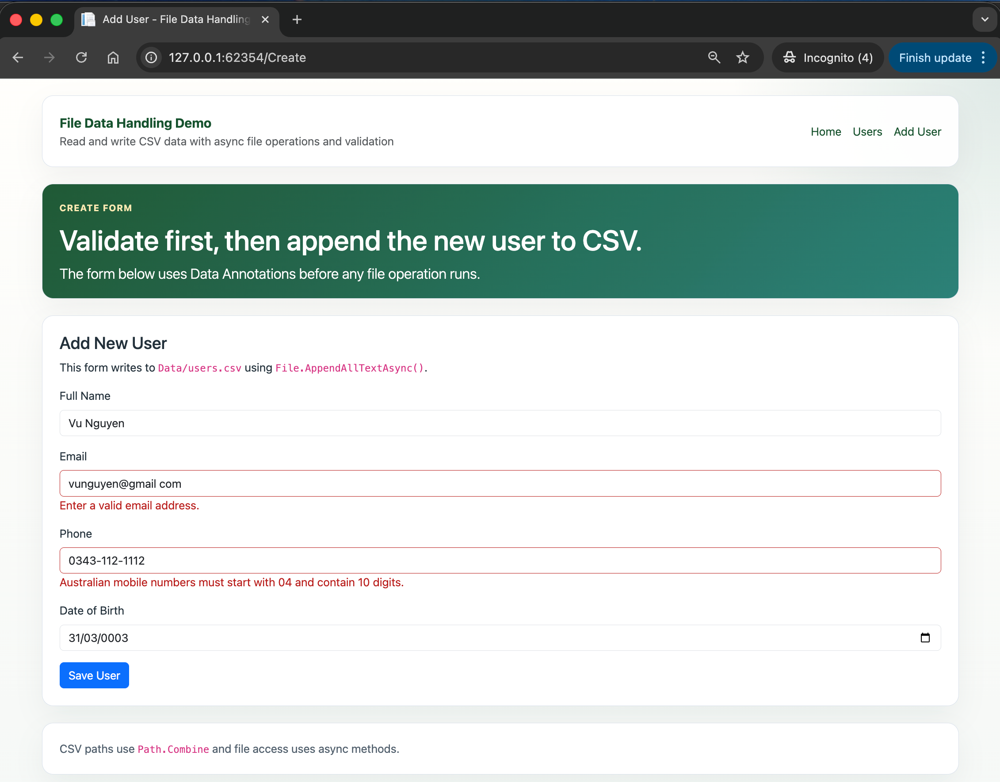
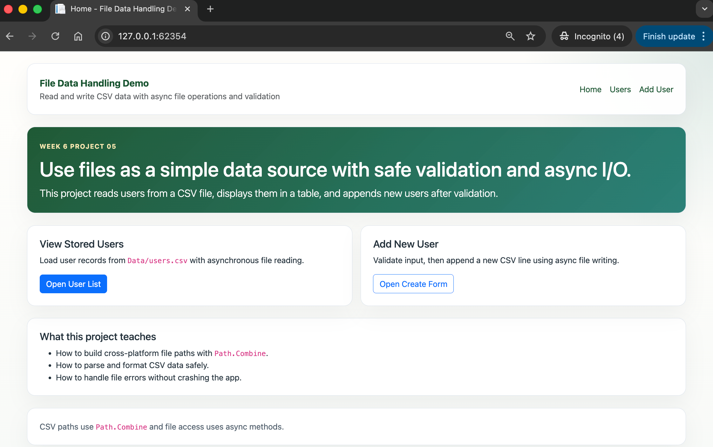
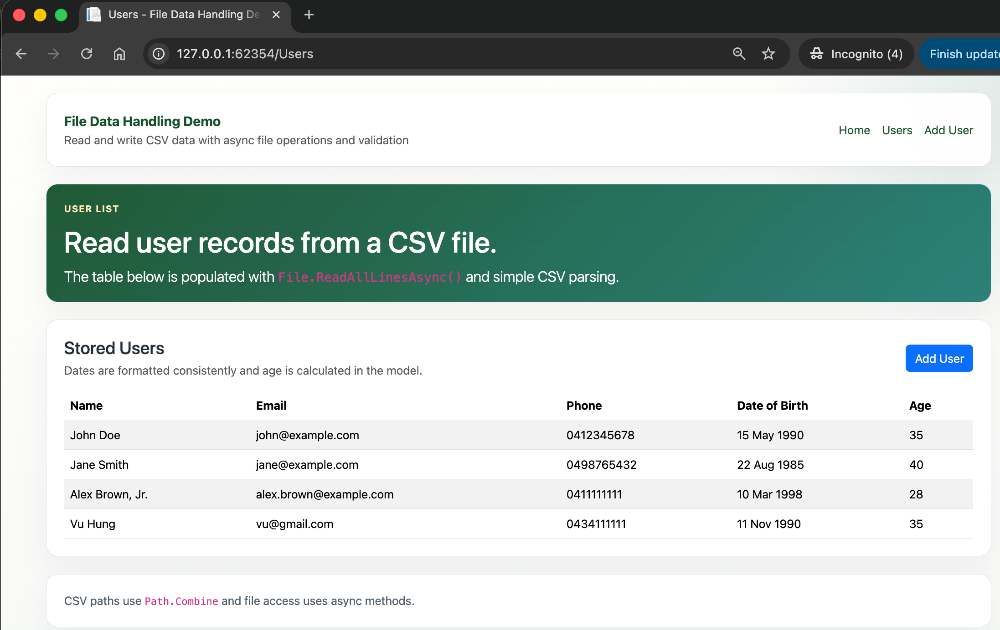

# 05.FileDataHandling

Simple ASP.NET Core Razor Pages project showing how to read and write CSV files with async file operations and validation.

## Screenshot

  

## Learning Objectives

- Read CSV data with `File.ReadAllLinesAsync()`
- Parse rows into user objects
- Validate form data before saving
- Append new rows with `File.AppendAllTextAsync()`
- Handle file errors with friendly messages
- Build file paths with `Path.Combine`

## What Is Included

- `Data/users.csv` with sample user records
- `CsvUserService` for async CSV reading and writing
- `UserRecord` model with validation attributes
- `Users` page to list all stored users
- `Create` page to add a new user

## Project Structure

```text
05.FileDataHandling/
├── CustomValidators/
├── Data/
├── Models/
├── Pages/
│   ├── Create.cshtml
│   ├── Users.cshtml
│   └── Shared/
├── Services/
├── docs/
├── QUICKSTART.md
└── README.md
```

## Key Idea

File operations should be asynchronous, validated, and protected with error handling before users depend on them.
