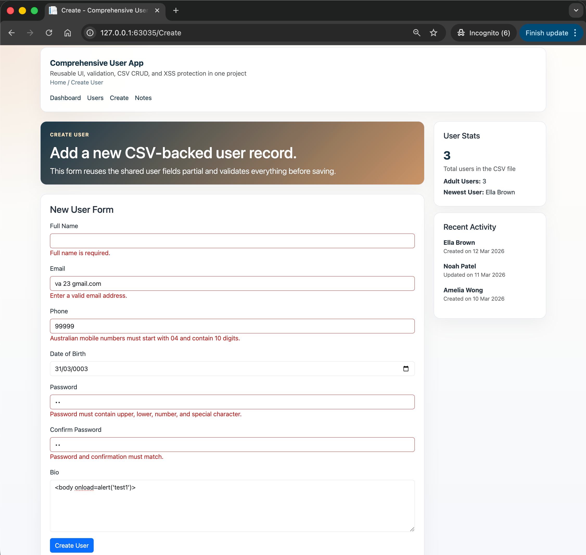
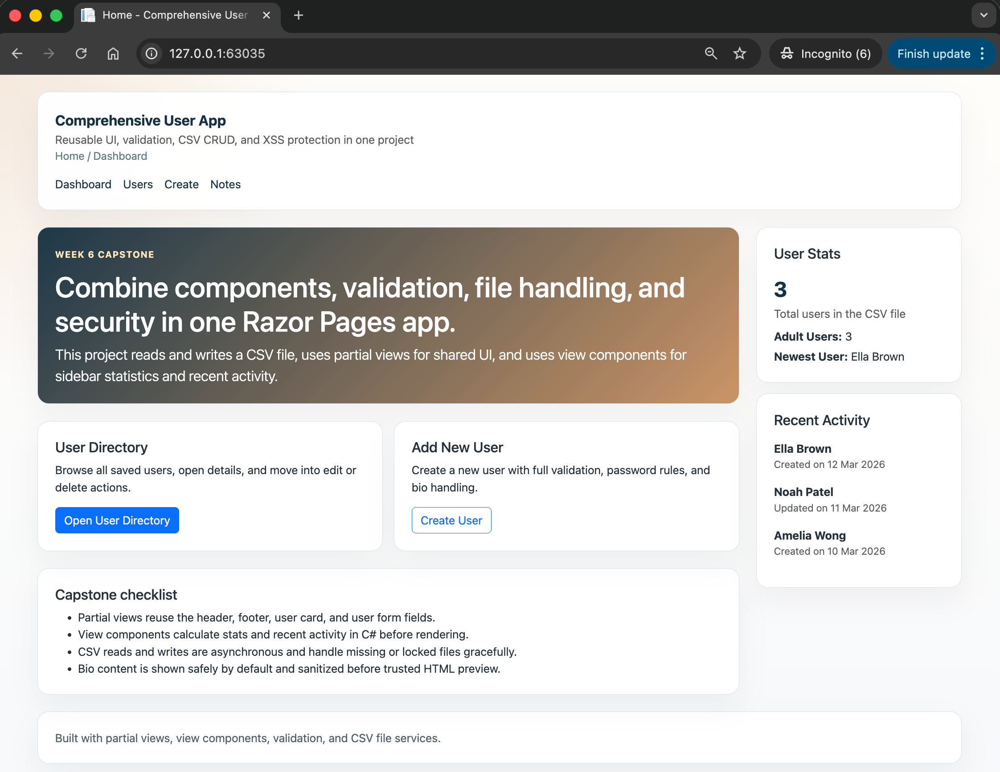
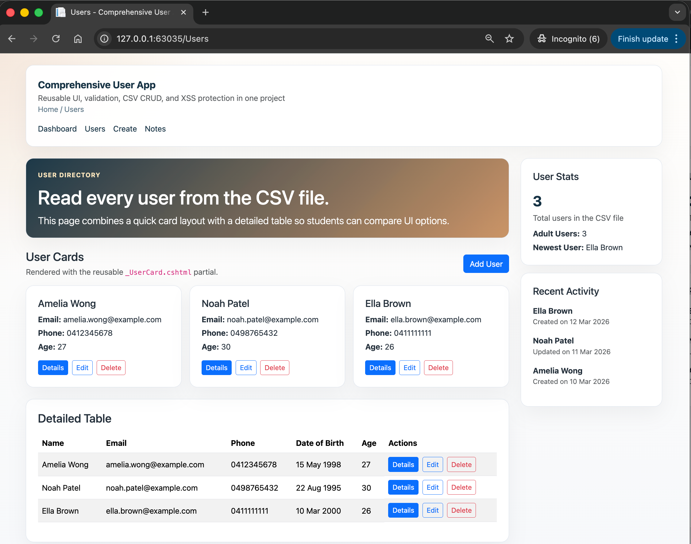

# 06.ComprehensiveApp

Capstone ASP.NET Core Razor Pages project combining partial views, view components, validation, CSV file CRUD, and safe bio rendering.

## Screenshot

  

## Learning Objectives

- Reuse shared markup with partial views
- Render sidebar data with view components
- Apply full validation rules to create and edit forms
- Read, add, update, and delete users in a CSV file
- Prevent unsafe HTML rendering in user biographies

## What Is Included

- `User` model with complete validation rules
- `CsvUserService` for async CSV CRUD operations
- Shared partials for header, footer, user card, and user form
- `UserStats` and `RecentActivity` view components
- Full CRUD pages: list, details, create, edit, and delete

## Project Structure

```text
06.ComprehensiveApp/
├── CustomValidators/
├── Data/
├── Models/
├── Pages/
│   ├── Create.cshtml
│   ├── Delete.cshtml
│   ├── Details.cshtml
│   ├── Edit.cshtml
│   ├── Users.cshtml
│   └── Shared/
├── Services/
├── ViewComponents/
├── Views/Shared/Components/
├── docs/
├── QUICKSTART.md
└── README.md
```

## Key Idea

The capstone app keeps responsibilities separate: pages handle requests, services handle CSV data, partials reuse UI, and view components handle sidebar logic.
