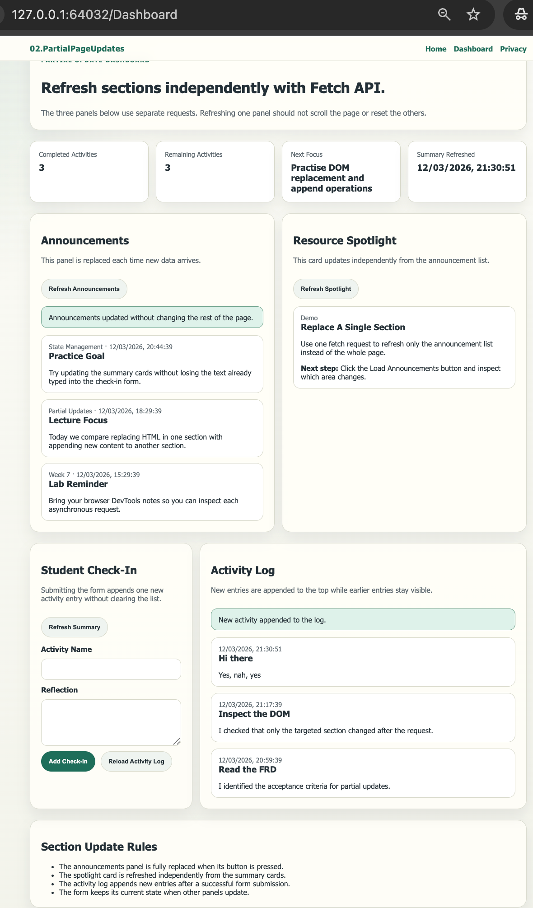
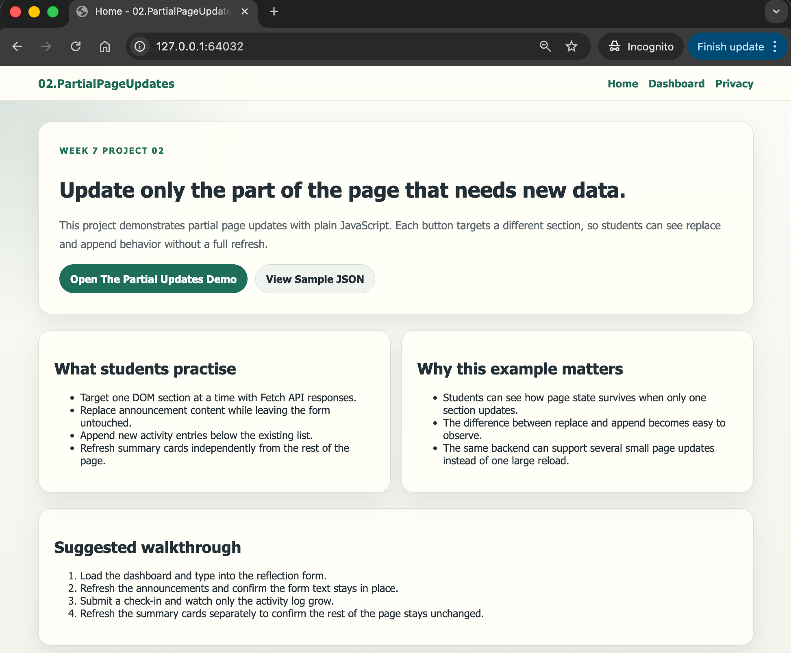

# 02.PartialPageUpdates

Simple ASP.NET Core Razor Pages project showing how Fetch API can update specific parts of the page without a full reload.


## Screenshots


 


## Learning Objectives

- Target specific DOM sections for independent updates
- Replace or append content dynamically after Fetch API requests
- Keep form state while nearby panels update
- Refresh multiple sections from separate backend endpoints
- Observe how partial updates improve the user experience

## What Is Included

- Razor Pages frontend with a dashboard designed for independent updates
- `LearningDashboardController` with small JSON endpoints for each page section
- `LearningDashboardService` using in-memory sample data for announcements, spotlight content, and activity logs
- Plain JavaScript file that refreshes summary cards, announcement lists, spotlight content, and activity entries
- Beginner-focused documentation in `QUICKSTART.md` and `docs/Key-Takeaways.md`

## Project Structure

```text
02.PartialPageUpdates/
├── Controllers/
├── Models/
├── Pages/
│   ├── Dashboard.cshtml
│   ├── Index.cshtml
│   ├── Privacy.cshtml
│   └── Shared/
├── Services/
├── docs/
├── QUICKSTART.md
└── README.md
```

## Key Idea

Partial page updates work best when the server provides small, focused endpoints and the browser updates only the section that actually changed.
