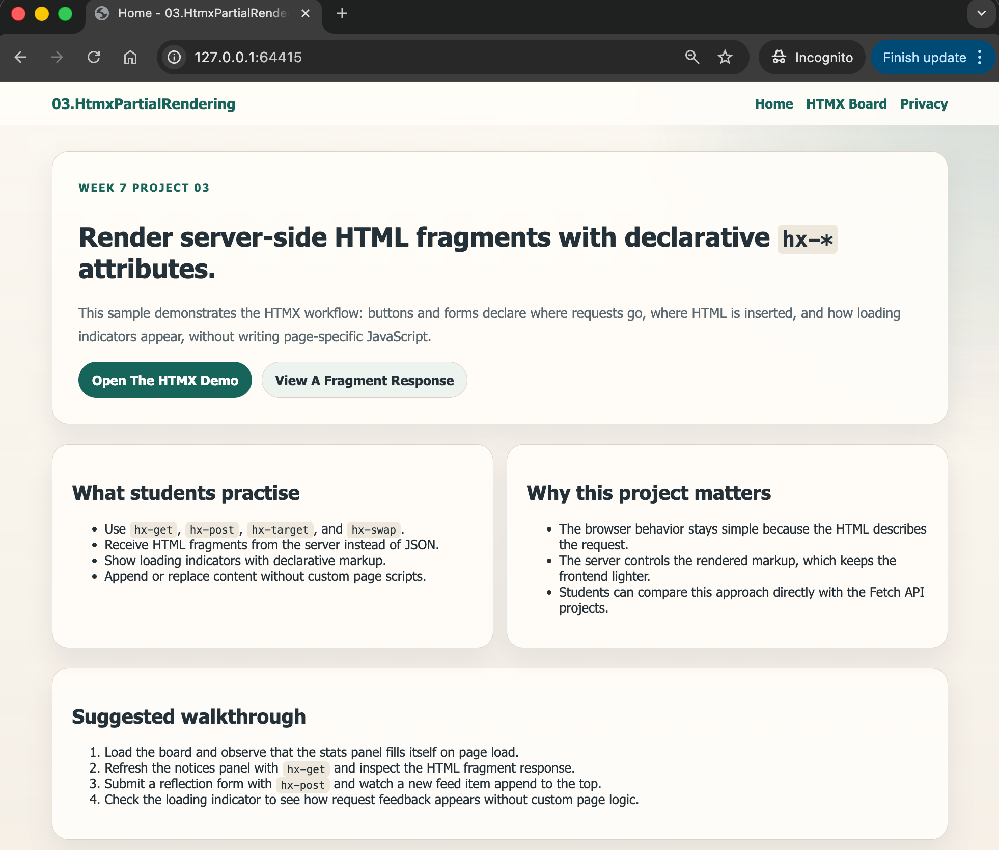
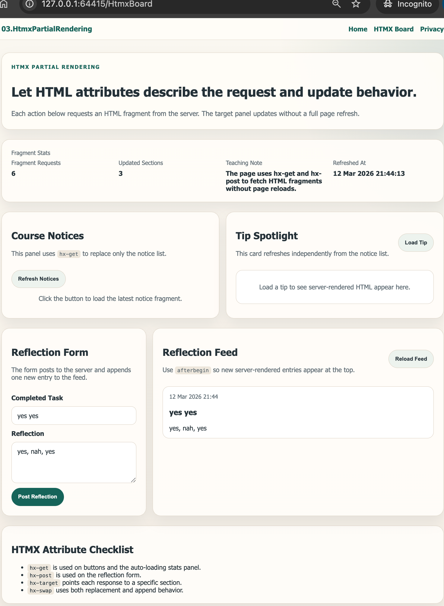

# 03.HtmxPartialRendering

Simple ASP.NET Core Razor Pages project showing how HTMX-style attributes can request server-rendered HTML fragments without page-specific JavaScript.

## Screenshots

 

## Learning Objectives

- Use `hx-get`, `hx-post`, `hx-target`, and `hx-swap` in Razor markup
- Return HTML fragments from ASP.NET Core instead of JSON
- Show loading indicators during fragment requests
- Append or replace content declaratively
- Compare HTMX-style updates with the earlier Fetch API projects

## What Is Included

- Razor Pages frontend with an HTMX-focused demo board
- `HtmxFragmentsController` returning HTML fragment partial views
- `HtmxCourseService` using in-memory classroom data
- Shared fragment views for notices, tips, statistics, reflection feed items, and validation errors
- A local offline `htmx-lite.js` helper that supports the core attributes used in this project
- Beginner-focused documentation in `QUICKSTART.md` and `docs/Key-Takeaways.md`

## Project Structure

```text
03.HtmxPartialRendering/
├── Controllers/
├── Models/
├── Pages/
│   ├── HtmxBoard.cshtml
│   ├── Index.cshtml
│   ├── Privacy.cshtml
│   └── Shared/
├── Services/
├── Views/
│   └── Shared/Fragments/
├── docs/
├── QUICKSTART.md
└── README.md
```

## Key Idea

HTMX-style partial rendering works by sending small requests for HTML fragments, then inserting those fragments directly into targeted page sections.
