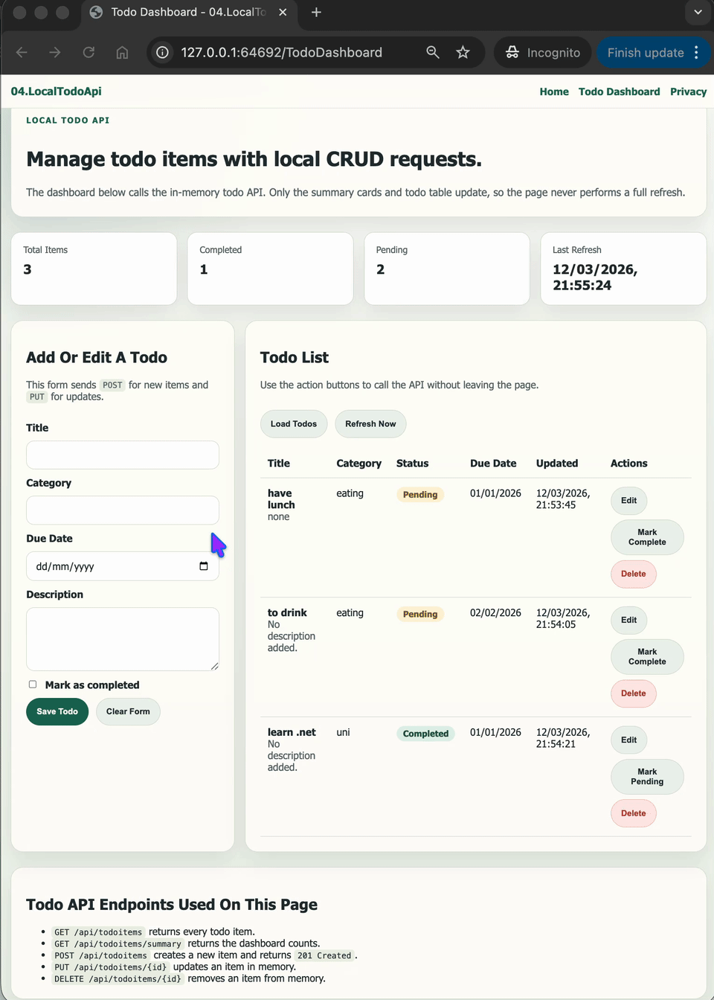

# 04.LocalTodoApi

Simple ASP.NET Core Razor Pages project showing how to build a complete local Todo API with offline CRUD and an in-memory data store.

## Screenshots



## Learning Objectives

- Build a self-contained local API with in-memory storage
- Use `GET`, `POST`, `PUT`, and `DELETE` for todo CRUD operations
- Return clear HTTP status codes for successful and failed requests
- Connect a Razor Pages frontend to the same local API
- Use loading states and polling to keep the dashboard current

## What Is Included

- Razor Pages frontend with a local todo dashboard
- `TodoItemsController` exposing RESTful JSON endpoints
- `TodoItemService` using in-memory sample data so the app works offline
- Plain JavaScript file that loads, creates, updates, toggles, and deletes todo items
- Development CORS configuration for future multi-port local demos
- Beginner-focused documentation in `QUICKSTART.md` and `docs/Key-Takeaways.md`

## Project Structure

```text
04.LocalTodoApi/
├── Controllers/
├── Models/
├── Pages/
│   ├── Index.cshtml
│   ├── Privacy.cshtml
│   ├── TodoDashboard.cshtml
│   └── Shared/
├── Services/
├── docs/
├── QUICKSTART.md
└── README.md
```

## Key Idea

A complete local application can teach API design and frontend integration without databases, cloud services, or external APIs.
