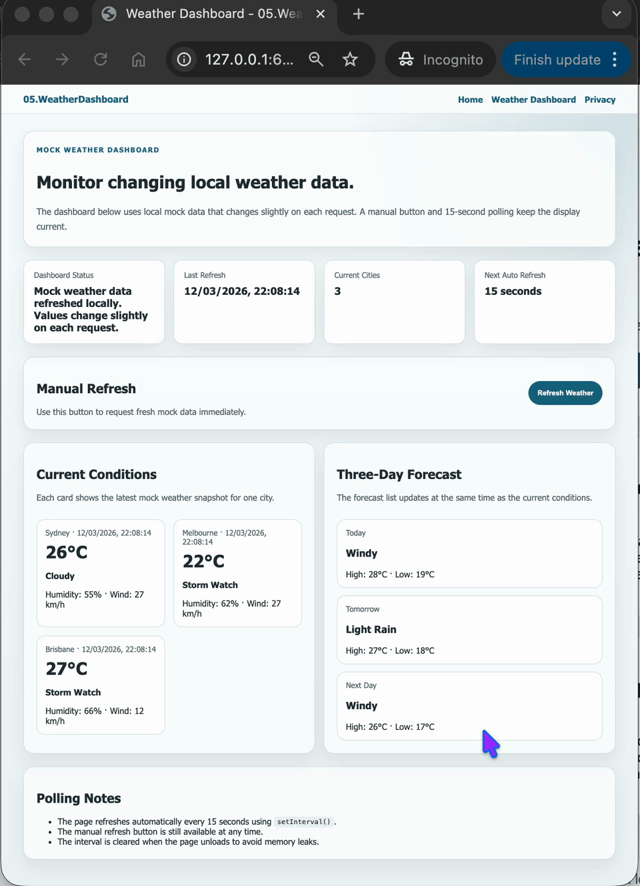

# 05.WeatherDashboard

Simple ASP.NET Core Razor Pages project showing how to build a local weather dashboard with mock data, manual refresh, and automatic polling.

## Screenshots



## Learning Objectives

- Fetch mock weather data from a local ASP.NET Core API
- Refresh dashboard content manually and automatically
- Use `setInterval()` for periodic updates every 15 seconds
- Display loading, success, and error states clearly
- Simulate changing data without relying on an external weather service

## What Is Included

- Razor Pages frontend with a weather dashboard view
- `WeatherDashboardController` returning mock weather JSON
- `WeatherSimulationService` that changes local weather values slightly on each request
- Plain JavaScript file that loads data and starts 15-second polling
- Beginner-focused documentation in `QUICKSTART.md` and `docs/Key-Takeaways.md`

## Project Structure

```text
05.WeatherDashboard/
├── Controllers/
├── Models/
├── Pages/
│   ├── Dashboard.cshtml
│   ├── Index.cshtml
│   ├── Privacy.cshtml
│   └── Shared/
├── Services/
├── docs/
├── QUICKSTART.md
└── README.md
```

## Key Idea

Mock data is enough to teach dashboard refresh patterns, polling, and asynchronous updates before introducing real external APIs.
