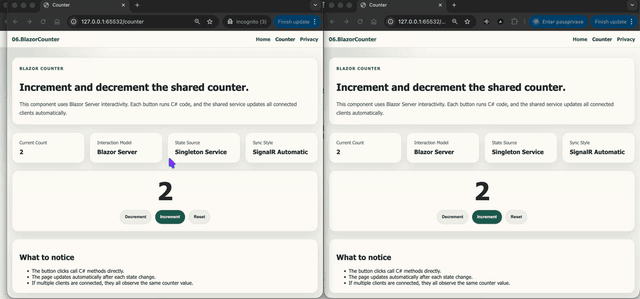

# 06.BlazorCounter

Simple ASP.NET Core Blazor Server project showing how a shared counter component can respond to button clicks and stay in sync across connected clients.


## Screenshots





## Learning Objectives

- Create a basic interactive Blazor component
- Handle button click events with C# methods
- Update the UI automatically when shared state changes
- Observe Blazor Server real-time sync behavior
- Compare Blazor interactivity with earlier Fetch API and HTMX examples

## What Is Included

- Blazor Server app with interactive server components
- `CounterStateService` singleton for shared counter state
- Home, Counter, Privacy, Error, and Not Found pages
- Increment, decrement, and reset buttons implemented in C#
- Beginner-focused documentation in `QUICKSTART.md` and `docs/Key-Takeaways.md`

## Project Structure

```text
06.BlazorCounter/
├── Components/
│   ├── Layout/
│   └── Pages/
├── Properties/
├── Services/
├── docs/
├── wwwroot/
├── QUICKSTART.md
└── README.md
```

## Key Idea

Blazor Server lets the browser trigger C# component methods directly, while SignalR connection handling and UI synchronization happen automatically.
