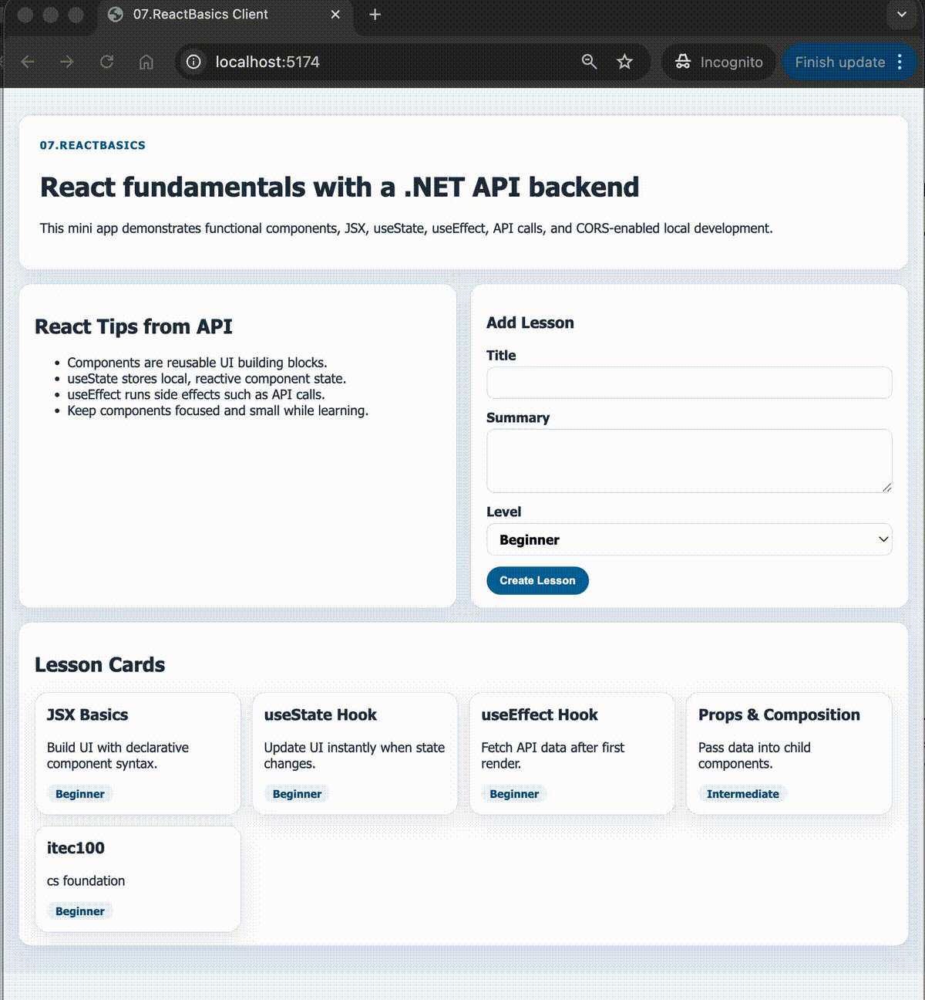

# 07. React Basics

This module introduces React fundamentals with a Vite frontend and an ASP.NET Core backend API.

## Learning goals

- Create functional React components with JSX
- Manage local state with `useState`
- Fetch backend data with `useEffect`
- Submit data to .NET Minimal APIs
- Understand CORS and local dev proxy setup

## Demo

Backend API:

- `GET /api/tips`
- `GET /api/lessons`
- `POST /api/lessons`

Frontend app:

- `ClientApp` (Vite + React)

## Project structure highlights

- `Program.cs`: .NET minimal API + CORS setup
- `ClientApp/src/App.jsx`: hook-based root component
- `ClientApp/src/components/LessonCard.jsx`: reusable presentational component
- `ClientApp/src/components/AddLessonForm.jsx`: controlled form with `useState`
- `ClientApp/vite.config.js`: dev proxy to backend API
- `docs/Key-Takeaways.md`: concept recap and next practice tasks

## Notes

For development, run backend on `http://localhost:5090` and frontend on `http://localhost:5173`.
The Vite proxy forwards `/api/*` requests to the .NET backend.
