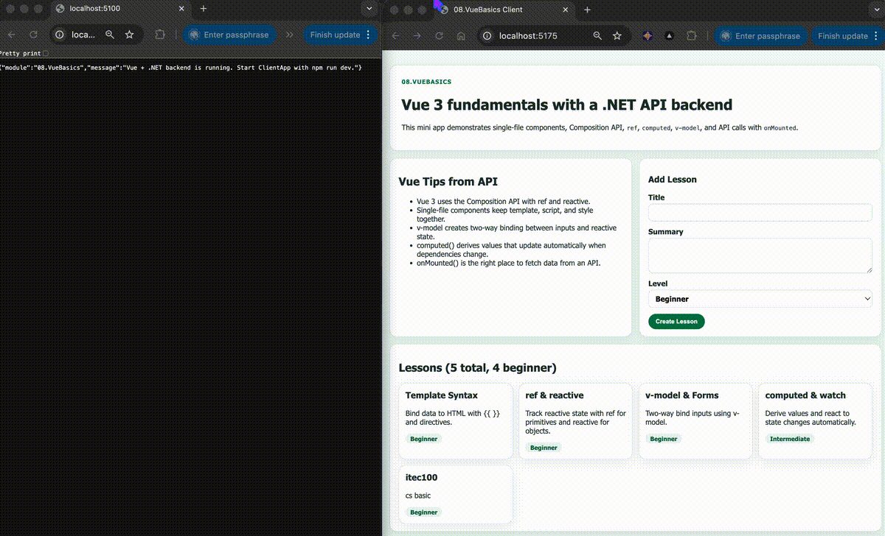

# 08. Vue Basics

This module introduces Vue 3 fundamentals with a Vite frontend and an ASP.NET Core backend API.

## Demo

## Learning goals

- Create Vue 3 single-file components (SFC)
- Use the Composition API (`ref`, `reactive`, `computed`)
- Bind inputs two-way with `v-model`
- Fetch backend data with `onMounted`
- Submit data to .NET Minimal APIs
- Understand CORS and local dev proxy setup
- Compare Vue's approach with React (07.ReactBasics)

## Backend API

- `GET /api/tips`
- `GET /api/lessons`
- `POST /api/lessons`

## Frontend app

- `ClientApp` (Vite + Vue 3)

## Project structure highlights

- `Program.cs`: .NET minimal API + CORS setup
- `ClientApp/src/App.vue`: root component with Composition API
- `ClientApp/src/components/LessonCard.vue`: presentational component with `defineProps`
- `ClientApp/src/components/AddLessonForm.vue`: form component with `v-model` and `defineEmits`
- `ClientApp/vite.config.js`: dev proxy to backend API
- `docs/Key-Takeaways.md`: concept recap and practice tasks

## Notes

For development, run backend on `http://localhost:5100` and frontend on `http://localhost:5175`.
The Vite proxy forwards `/api/*` requests to the .NET backend.
