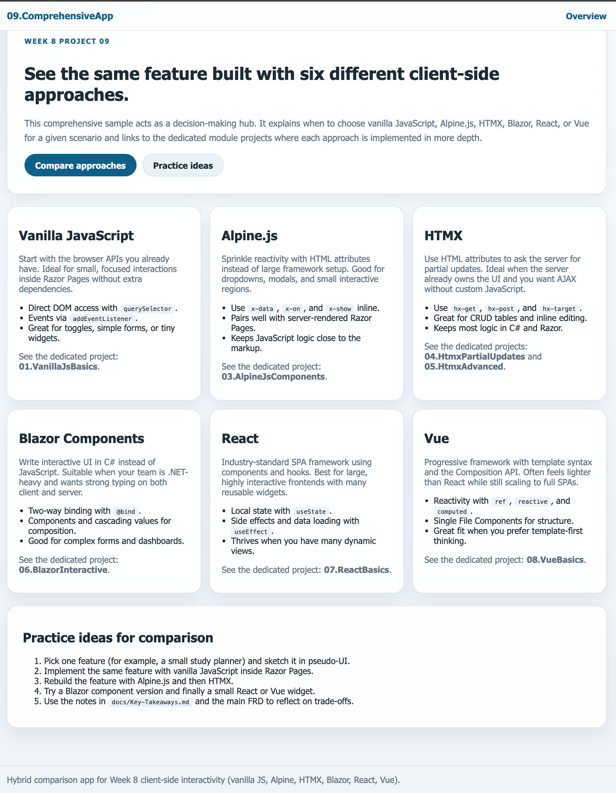

# Client-Side Interactivity

## Week 8 Learning Module

### Demo / Screenshots

### What We're Building

Learn how to create highly responsive, interactive web applications using modern JavaScript approaches - from vanilla JS to enterprise frameworks.

### Learning Objectives

By the end of this module, you will:

- ✅ Use modern JavaScript (ES6+) instead of jQuery
- ✅ Master async programming with Promises and async/await
- ✅ Build lightweight interactive UIs with Alpine.js
- ✅ Create partial page updates using HTMX
- ✅ Understand when to use component frameworks (Blazor, React, Vue)
- ✅ Make informed decisions about client-side architecture

### Why This Matters

**Instant Feedback:** Users expect immediate responses - no full page reloads  
**Better UX:** Smooth interactions feel more like native apps  
**Modern Standards:** jQuery is legacy; modern browsers have native solutions  
**Career Readiness:** Learn the tools used in 2026 development

### The Three Pillars of Modern Frontend

1. **Modern Vanilla JS** - Native browser APIs for everyday tasks
2. **Minimalist Interactivity** - HTMX and Alpine.js for behavior without heavy frameworks
3. **Component Frameworks** - Blazor, React, Vue for enterprise-scale UIs

### Module Structure

| Project | Focus | Key Technologies |
|---------|-------|------------------|
| **01.VanillaJsBasics** | DOM manipulation, events | querySelector, classList, fetch |
| **02.PromisesAsyncAwait** | Async patterns | Promises, async/await, Fetch API |
| **03.AlpineJsComponents** | Lightweight reactivity | Alpine.js directives |
| **04.HtmxPartialUpdates** | No-JS partial updates | HTMX CRUD operations |
| **05.HtmxAdvanced** | Advanced patterns | Search, infinite scroll, polling |
| **06.BlazorInteractive** | C# for frontend | Blazor components |
| **07.ReactBasics** | Industry standard SPA | React hooks, JSX |
| **08.VueBasics** | Progressive framework | Vue 3 Composition API |
| **09.ComprehensiveApp** | Compare all approaches | Hybrid architecture |

### Essential Questions

- How do we manage client-side libraries in .NET?
- When should logic run on the client vs. the server?
- Which framework is right for my project?
- How do I balance performance with developer experience?

### Quick Start

1. Read [QUICKSTART.md](QUICKSTART.md) for setup instructions
2. Review [docs/WhyNotJQuery.md](docs/WhyNotJQuery.md) for context
3. Start with `01.VanillaJsBasics` and progress sequentially
4. Compare approaches in `09.ComprehensiveApp`

### Documentation

| Guide | Purpose |
|-------|---------|
| [Why Not jQuery?](docs/WhyNotJQuery.md) | Historical context and migration |
| [Modern JavaScript](docs/ModernJavaScript.md) | ES6+, Promises, async/await |
| [Framework Comparison](docs/FrameworkComparison.md) | Blazor vs React vs Vue |
| [SPA Architecture](docs/SPAArchitecture.md) | Single Page Application concepts |
| [Package Management](docs/PackageManagement.md) | NuGet, NPM, LibMan |

### Prerequisites

- Basic JavaScript knowledge
- ASP.NET Core Razor Pages fundamentals
- Understanding of HTTP requests/responses
- Completed [07.AjaxDynamicContent](../07.AjaxDynamicContent)

### Assessment Ideas

- Build an interactive dashboard using HTMX
- Create a todo app with Alpine.js
- Compare implementations: same feature using different approaches
- Choose the right tool for a given scenario

