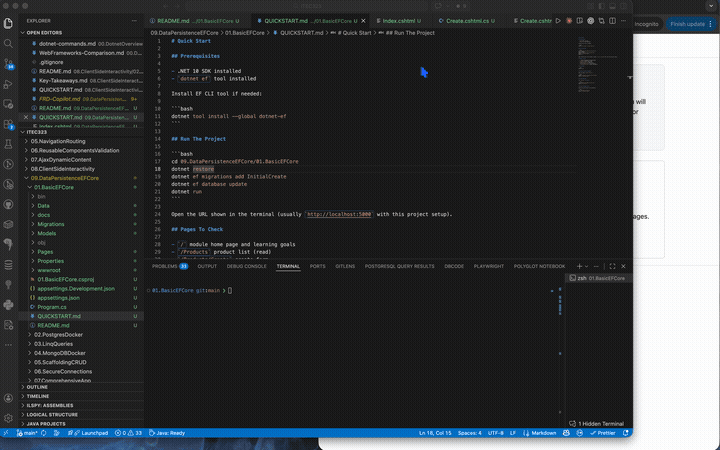

# 01.BasicEFCore

Beginner-friendly ASP.NET Core Razor Pages project for the first Entity Framework Core workflow.


## Demo Video




## Learning Objectives

- Understand what an ORM does in a .NET web app.
- Create an entity class using data annotations.
- Register `DbContext` in `Program.cs`.
- Create and apply database migrations with `dotnet ef`.
- Perform async CRUD operations from Razor PageModels.

## What This Project Demonstrates

- EF Core 10 with SQLite provider
- `Product` entity with validation attributes
- `AppDbContext` with a `DbSet<Product>`
- Razor Pages CRUD screens:
  - `/Products` list page
  - `/Products/Create`
  - `/Products/Edit/{id}`
  - `/Products/Details/{id}`
  - `/Products/Delete/{id}`
- Bootstrap-based forms, tables, and validation feedback

## Project Structure

```text
01.BasicEFCore/
├── Data/
│   └── AppDbContext.cs
├── Models/
│   └── Product.cs
├── Pages/
│   ├── Products/
│   ├── Index.cshtml
│   ├── Privacy.cshtml
│   └── Shared/
├── docs/
│   └── Key-Takeaways.md
├── wwwroot/
├── Program.cs
├── appsettings.json
├── QUICKSTART.md
└── README.md
```

## Key Commands

```bash
# From 09.DataPersistenceEFCore/01.BasicEFCore

dotnet restore
dotnet ef migrations add InitialCreate
dotnet ef database update
dotnet run
```

## Why This Matters

Using EF Core lets you write strongly typed C# queries and avoid fragile SQL string handling in beginner projects. This improves readability, safety, and development speed.
