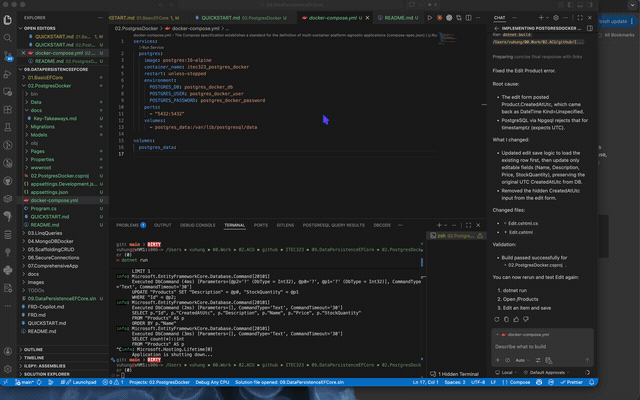

# 02.PostgresDocker

Beginner-friendly ASP.NET Core Razor Pages project that demonstrates EF Core with PostgreSQL running in Docker.

# Demo 



Full-resolution version: [images/postgres-docker-demo.gif](images/postgres-docker-demo.gif)


## Learning Objectives

- Configure EF Core 10 with PostgreSQL provider.
- Run PostgreSQL 16 using Docker Compose.
- Apply migrations to a containerized relational database.
- Perform async CRUD operations from Razor Pages.
- Practice safe connection string handling with User Secrets.

## What This Project Demonstrates

- EF Core 10 + Npgsql provider
- `Product` entity with data annotations
- `AppDbContext` registered in dependency injection
- Razor Pages CRUD workflow for `/Products`
- Docker Compose PostgreSQL service with persistent volume

## Project Structure

```text
02.PostgresDocker/
├── Data/
│   └── AppDbContext.cs
├── Models/
│   └── Product.cs
├── Migrations/
├── Pages/
│   ├── Products/
│   ├── Index.cshtml
│   ├── Privacy.cshtml
│   └── Shared/
├── docs/
│   └── Key-Takeaways.md
├── wwwroot/
├── docker-compose.yml
├── Program.cs
├── appsettings.json
├── QUICKSTART.md
└── README.md
```

## Key Commands

```bash
# From 09.DataPersistenceEFCore/02.PostgresDocker

docker compose up -d
dotnet restore
dotnet ef database update
dotnet run
```

## Why This Matters

This project connects classroom EF Core concepts to a production-style database workflow by using PostgreSQL in a container instead of a local file database.
