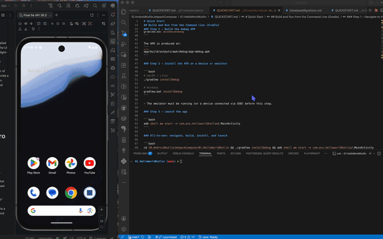

# 01.HelloWorldKotlin

A first Android app built with Kotlin and Jetpack Compose.

# Demo 

## What You Build
- A centred screen with `Hello Android 16!`
- A Material 3 button
- A click counter using `remember`

## Learning Focus
- Create an Android app with an Empty Activity
- Write simple `@Composable` functions
- Manage local UI state in Compose

## Project Files
- `app/src/main/java/` contains the Kotlin code
- `app/src/main/res/` contains strings and theme resources
- `docs/Key-Takeaways.md` summarises the main ideas

## Expected Result
When the app runs, the button increases the counter each time it is pressed.
