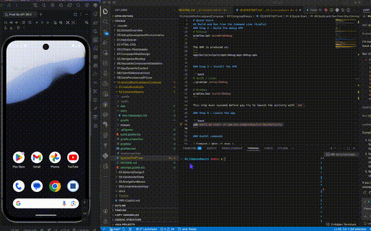

# 02.ComposeBasics

A beginner Android app for practising core Jetpack Compose controls.

## Demo 

## What You Build
- A form with `TextField`, `Checkbox`, and `Switch`
- A live preview of the entered data
- A `LazyColumn` that lists the preview items

## Learning Focus
- Store UI state with `remember`
- Update the screen as state changes
- Break a screen into small composable functions

## Project Files
- `app/src/main/java/` contains the Kotlin code
- `app/src/main/res/` contains strings and theme resources
- `docs/Key-Takeaways.md` summarises the main ideas

## Expected Result
When the app runs, the form updates the preview list immediately as the user changes each control.
