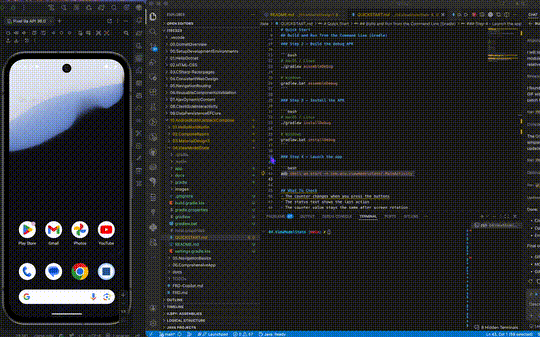

# 04.ViewModelState

A beginner Android app for practising state management with a ViewModel.

## Demo

## What You Build
- A counter screen powered by `ViewModel`
- Buttons to increment, decrement, and reset the count
- UI that reads `StateFlow` from the ViewModel

## Learning Focus
- Move business logic out of composables
- Observe `StateFlow` in Compose
- Keep state alive through configuration changes

## Project Files
- `app/src/main/java/` contains the Kotlin code
- `app/src/main/res/` contains strings and theme resources
- `docs/Key-Takeaways.md` summarises the main ideas

## Expected Result
When the app runs, the counter updates through the ViewModel and keeps its value during screen rotation.
