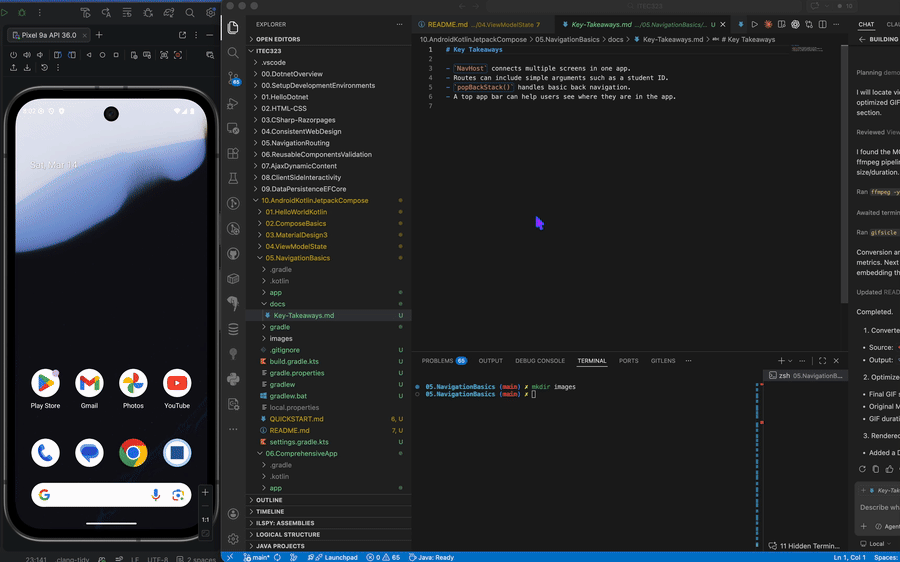

# 05.NavigationBasics

A beginner Android app for practising multi-screen navigation with Jetpack Compose.

## Demo

## What You Build
- A `NavHost` with three destinations
- A student list screen that navigates to detail
- A detail screen that receives a student ID

## Learning Focus
- Define simple navigation routes
- Pass data between destinations
- Use back navigation and show the current route title

## Project Files
- `app/src/main/java/` contains the Kotlin code
- `app/src/main/res/` contains strings and theme resources
- `docs/Key-Takeaways.md` summarises the main ideas

## Expected Result
When the app runs, the user can move between welcome, list, and detail screens and return using back navigation.
