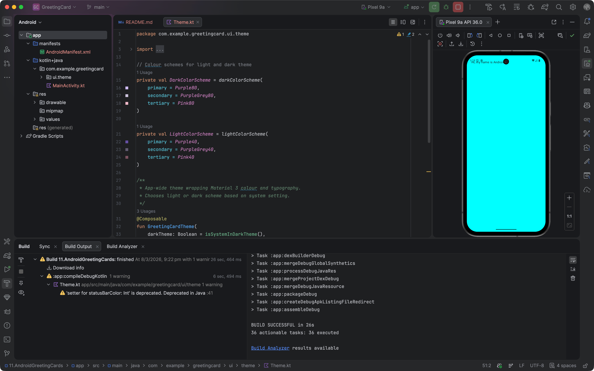

# Greeting Card (Android)

A simple Android app built with **Kotlin** and **Jetpack Compose** that displays a customisable greeting. It follows the [Create your first Android app](https://developer.android.com/codelabs/basic-android-kotlin-compose-first-app) codelab (steps 1–8).

# Screenshot(s)

## Overview

The app shows a single screen with the text “Hi, my name is [name]!” on a coloured background. Students learn how to create a Compose project, update UI with composables, use `Surface` and `Modifier`, and preview the app in Android Studio.

## Learning objectives

- Create an Android project with the Empty Activity (Compose) template
- Understand the role of `MainActivity`, `onCreate()`, and `setContent()`
- Write **composable functions** with `@Composable` and use `Text` and `Surface`
- Use **Modifier** (e.g. `padding`, `fillMaxSize`) to lay out and style UI
- Use **Preview** to see composables in the Design view without running the app
- Follow basic project structure (packages, theme, resources)

## Key concepts

| Concept | Description |
|--------|-------------|
| **Jetpack Compose** | Declarative UI toolkit: you describe what the screen should look like, not how to build it step by step. |
| **Composable** | A function annotated with `@Composable` that describes a piece of UI. Names use PascalCase; they do not return a value. |
| **Surface** | A container that can have a background colour, shape, or border. |
| **Modifier** | Chain of behaviour/layout changes (e.g. `padding`, `fillMaxSize`) applied to a composable. |

## Technology stack

- **Language:** Kotlin  
- **UI:** Jetpack Compose (Material 3)  
- **Min SDK:** 24 (Android 7.0)  
- **Target SDK:** 35  
- **Build:** Gradle (Kotlin DSL), Android Gradle Plugin 8.7.x  

## Documentation

- [QUICKSTART.md](QUICKSTART.md) – Setup and run instructions  
- [FRD.md](FRD.md) – Functional requirements and acceptance criteria  
- [FRD-Copilot.md](FRD-Copilot.md) – Copilot/agent guidelines for code generation  
- [docs/Key-Takeaways.md](docs/Key-Takeaways.md) – Concepts and best practices summary  

## Codelab reference

Based on: [Basic Android Kotlin Compose – Create your first app](https://developer.android.com/codelabs/basic-android-kotlin-compose-first-app#0) (steps 1–8).
