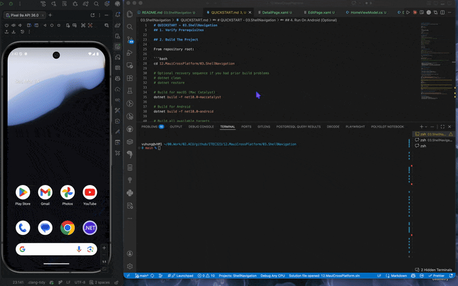
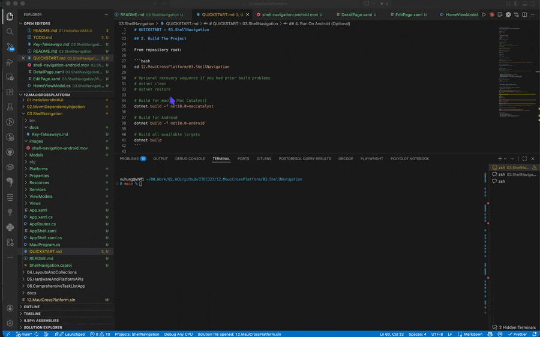

# 03.ShellNavigation

## Overview

This project introduces Shell-based URI navigation in .NET MAUI.

Compared with project 02, this app focuses on multi-page route flow and query-parameter navigation.

The app includes:

- Shell route registration in AppShell
- List -> Detail -> Edit navigation flow
- Query parameter passing with taskId
- Query parameter receiving via [QueryProperty]
- Relative back navigation with ..
- MVVM + DI structure matching previous projects

## Demo

### Android



### macOS (Mac Catalyst)




## Learning Objectives

By completing this project, you will be able to:

1. Define a Shell app structure and register custom routes.
2. Navigate between pages using Shell.Current.GoToAsync.
3. Pass route parameters through query strings.
4. Receive route parameters with [QueryProperty] in ViewModels.
5. Navigate back using relative URI syntax (..).
6. Build and run Shell navigation flows on Mac Catalyst or Android.

## Prerequisites

- .NET 10.0 SDK
- MAUI workload installed (dotnet workload install maui)
- macOS with Xcode tools for Mac Catalyst and/or Android SDK + emulator

## Project Structure

```text
03.ShellNavigation/
├── ShellNavigation.csproj              # MAUI + CommunityToolkit package setup
├── MauiProgram.cs                      # DI registrations and app startup
├── App.xaml                            # Global resources
├── AppShell.xaml                       # Shell root
├── AppShell.xaml.cs                    # Shell content + route registration
├── AppRoutes.cs                        # Central route names
├── Views/
│   ├── HomePage.xaml                   # List page route source
│   ├── DetailPage.xaml                 # Detail page route target
│   └── EditPage.xaml                   # Edit page route target
├── ViewModels/
│   ├── HomeViewModel.cs                # Loads list and opens detail route
│   ├── DetailViewModel.cs              # Receives taskId and opens edit route
│   └── EditViewModel.cs                # Two-way edit and save/cancel navigation
├── Services/
│   ├── ITaskRepository.cs              # Data contract for task lookup/update
│   └── InMemoryTaskRepository.cs       # In-memory demo data source
├── Models/
│   └── NavigationTask.cs               # Route-backed task model
├── QUICKSTART.md                       # Build/run guide
└── docs/
    └── Key-Takeaways.md                # Concepts recap
```

## Run The App

See [QUICKSTART.md](QUICKSTART.md) for step-by-step instructions.

Quick commands:

```bash
# From repository root
dotnet build 12.MauiCrossPlatform/03.ShellNavigation/ShellNavigation.csproj -f net10.0-maccatalyst

# Run on Mac Catalyst
dotnet build -t:Run --project 12.MauiCrossPlatform/03.ShellNavigation/ShellNavigation.csproj -f net10.0-maccatalyst
```

## What To Test

1. Open Home page and verify a list of tasks appears.
2. Tap View Detail and confirm navigation includes taskId query behavior.
3. Tap Edit Task and confirm values load in Edit page fields.
4. Modify values, tap Save, and confirm navigation returns to Detail.
5. Tap Back To List and confirm relative back navigation returns to Home.

## Next Project

After this project, continue to:

- 12.MauiCrossPlatform/04.LayoutsAndCollections

You will build responsive UIs with Grid, CollectionView, and richer list layouts.
