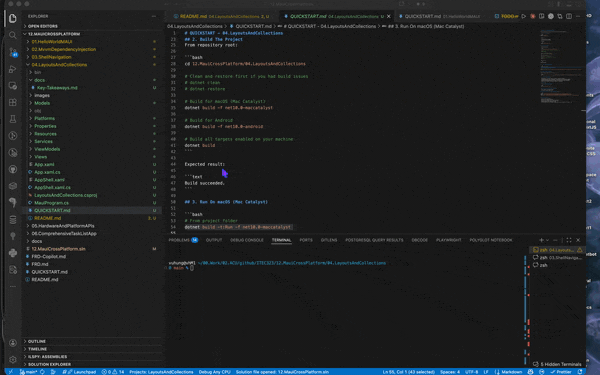

# 04.LayoutsAndCollections

## Overview

This project introduces responsive UI composition with MAUI layout containers and data-bound collections.

Compared with project 03, this app focuses on richer page structure and list rendering, not route flow.

The app includes:

- Grid-based form layout with labels, Entry, Editor, and Picker
- VerticalStackLayout and HorizontalStackLayout sections
- CollectionView bound to ObservableCollection data
- ItemTemplate card layout with title, description, and metadata
- EmptyView state when list data is cleared
- RefreshView pull-to-refresh with async reload

## Demo



## Learning Objectives

By completing this project, you will be able to:

1. Build form-like UI sections using Grid rows and columns.
2. Combine VerticalStackLayout and HorizontalStackLayout effectively.
3. Bind CollectionView to an ObservableCollection in a ViewModel.
4. Define a DataTemplate for reusable list item presentation.
5. Implement EmptyView and pull-to-refresh with RefreshView.
6. Build and run on macOS (Mac Catalyst) or Android.

## Prerequisites

- .NET 10.0 SDK
- MAUI workload installed (dotnet workload install maui)
- macOS with Xcode tools for Mac Catalyst and/or Android SDK + emulator

## Project Structure

```text
04.LayoutsAndCollections/
├── LayoutsAndCollections.csproj          # MAUI + CommunityToolkit package setup
├── MauiProgram.cs                        # DI registrations and app startup
├── App.xaml                              # Global resource dictionaries
├── AppShell.xaml                         # Shell host for the layouts demo page
├── Views/
│   ├── MainPage.xaml                     # Grid, stacks, RefreshView, CollectionView UI
│   └── MainPage.xaml.cs                  # Constructor injection + initial data load
├── ViewModels/
│   └── LayoutsCollectionsViewModel.cs    # ObservableCollection + relay commands
├── Services/
│   ├── ICollectionDataService.cs         # Collection data service contract
│   └── CollectionDataService.cs          # In-memory data provider
├── Models/
│   └── CollectionItem.cs                 # Item model used by CollectionView
├── QUICKSTART.md                         # Build/run guide
└── docs/
    └── Key-Takeaways.md                  # Concepts recap
```

## Run The App

See [QUICKSTART.md](QUICKSTART.md) for step-by-step instructions.

Quick commands:

```bash
# From repository root
dotnet build 12.MauiCrossPlatform/04.LayoutsAndCollections/LayoutsAndCollections.csproj -f net10.0-maccatalyst

# Run on Mac Catalyst
dotnet build -t:Run --project 12.MauiCrossPlatform/04.LayoutsAndCollections/LayoutsAndCollections.csproj -f net10.0-maccatalyst
```

## What To Test

1. Add a new item using the Grid form and confirm it appears in the list.
2. Pull down on the list and confirm RefreshView updates status text and timestamps.
3. Tap Clear List and confirm EmptyView appears.
4. Add another item after clearing and confirm list repopulates.

## Next Project

After this project, continue to:

- 12.MauiCrossPlatform/05.HardwareAndPlatformAPIs

You will access camera, location, and file-system APIs from shared MAUI code.
