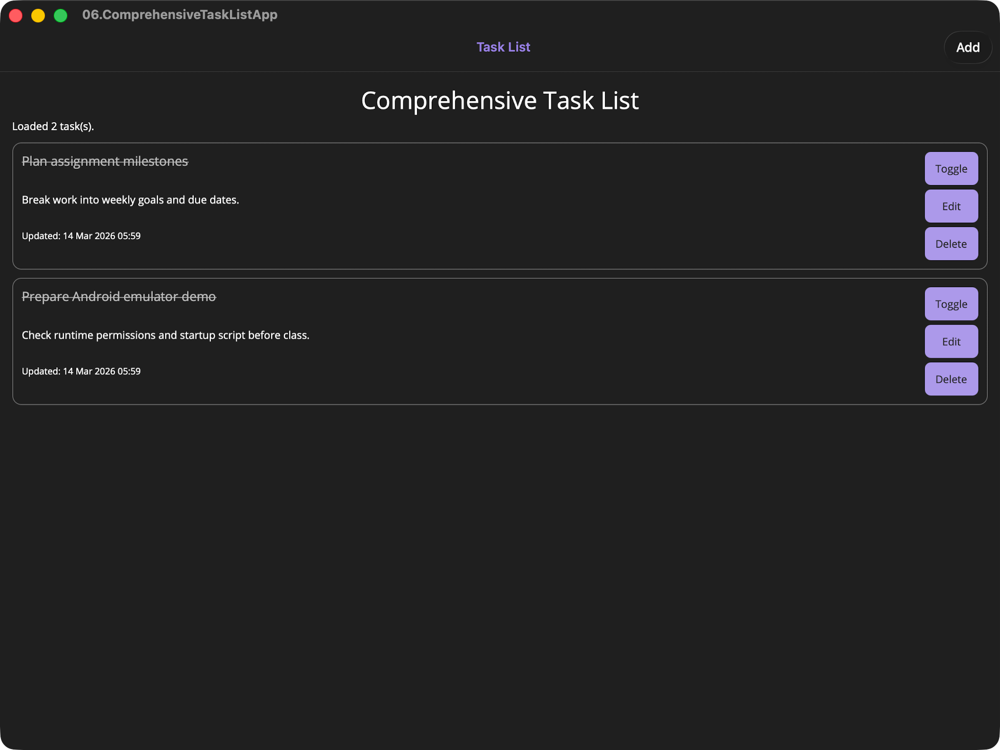

# 06.ComprehensiveTaskListApp

## Overview

This project combines all previous MAUI topics into a complete task management app:

1. MVVM with CommunityToolkit attributes and relay commands.
2. Shell-based route navigation for list and detail pages.
3. CollectionView-based list UI with add, edit, complete, and delete actions.
4. Local persistence using `Preferences` with JSON serialization.
5. Responsive layouts using Grid and StackLayout.

The app is designed as the final capstone for this MAUI learning sequence.

## Screenshot



## Features

- View persisted task list.
- Add a task with title and description.
- Edit existing task fields.
- Toggle completion state.
- Delete task with confirmation.
- Pull-to-refresh list.
- Seed starter tasks for first run.

## Project Structure

```text
06.ComprehensiveTaskListApp/
├── ComprehensiveTaskListApp.csproj      # MAUI project and package dependencies
├── MauiProgram.cs                       # DI registrations and app startup
├── App.xaml                             # Global resource dictionaries
├── AppShell.xaml                        # Shell host
├── AppRoutes.cs                         # Centralized route constants
├── Models/
│   └── TaskItem.cs                      # Task domain model
├── Services/
│   ├── ITaskDataService.cs              # Task persistence contract
│   └── TaskDataService.cs               # Preferences + JSON implementation
├── ViewModels/
│   ├── TaskListViewModel.cs             # List page commands and state
│   └── TaskDetailViewModel.cs           # Create/edit page logic
├── Views/
│   ├── MainPage.xaml                    # Task list UI
│   ├── MainPage.xaml.cs                 # List page lifecycle hook
│   ├── TaskDetailPage.xaml              # Task detail UI
│   └── TaskDetailPage.xaml.cs           # Detail page lifecycle hook
├── Platforms/                           # Platform-specific MAUI files
├── Resources/                           # Fonts, styles, images, splash and app icon
├── QUICKSTART.md                        # Build and run instructions
└── docs/
    └── Key-Takeaways.md                 # Concepts recap and FR mapping
```

## Learning Objectives

By completing this project, students can:

1. Build a multi-page MAUI app with Shell navigation.
2. Apply MVVM using CommunityToolkit observable properties and commands.
3. Implement full task CRUD flows with clear user feedback.
4. Persist data locally between app sessions.
5. Keep UI responsive using async commands and pull-to-refresh.

## Run The App

See QUICKSTART.md for commands targeting Mac Catalyst and Android.

## Suggested Test Flow

1. Launch the app and confirm initial seeded tasks appear.
2. Add a new task and verify it appears immediately.
3. Edit the new task and verify updates are saved.
4. Toggle completion and verify the list updates.
5. Delete a task and confirm it is removed after confirmation.
6. Relaunch the app and verify task data persists.
